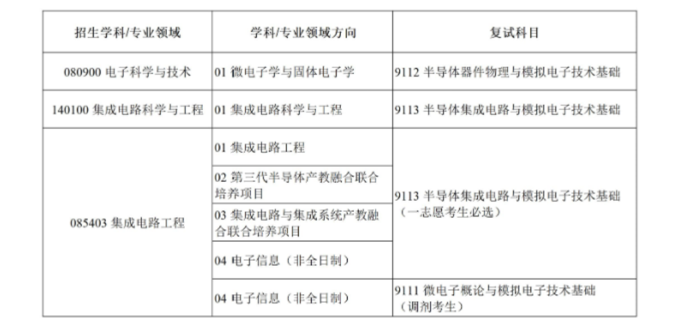
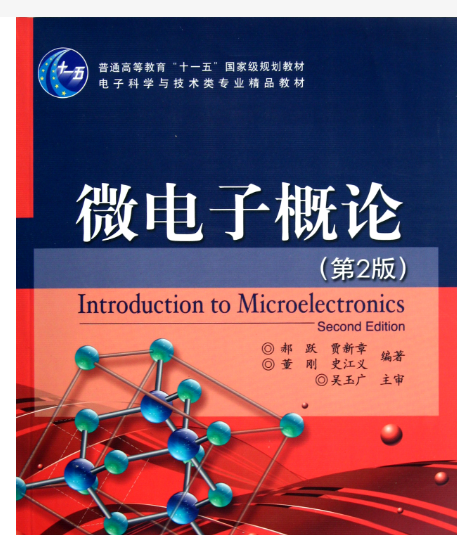

# XDU集成电路/微电子生存手册

​																													by ***zhuozibro***

****

***即使引导早已破碎，也请您当上艾尔登之王！——游戏《艾尔登法环》***

***

## (i)前言

不管你在何时何地以何种身份打开这份手册，我都希望你可以从中找到对你有帮助的东西。

这份手册最初开始时想写的原因是，接触了上交前辈们写下的《上海交通大学生生存手册》，他们的留下的文字，也给我的大学生活带来了不一样的思考，不管你是刚刚从高中毕业进入大学的懵懂少年，还是已经在大学中还有很多迷茫的懵逼青年，《上海交通大学生生存手册》一定程度都会给你带来不一样的思考或者是方向的选择，我也希望留下这种方式尽可能帮助到他人。

其次，随着集成电路/微电子行业的高速发展**(2024年看来还是这样的)**，更多的学生选择加入这个相关行业，但是行业行情是快速变化的，校内的培养体系却仍然顽固不变，这对你以后未来就业或者其他选择是不利的，不管你未来是选择走学术还是就业，我希望可以引导集成电路/微电子的同学看透一点行情、认清一点自己的方向发展，如果过了几年、十几年这个产业不太适合更远的发展了，我希望你可以早日找到属于自己合适的方向。

该手册，主要是面向西电XDU的微电子/集成电路的学生，也可以是其他电子类相关专业的同学。

本手册会从课程学习、就业、比赛、项目、考研、保研等多个方向进行汇总。

***先在此感谢每一个对手册内容编写提供帮助的同学，不管你是哪一届，哪一级***

****

## (ii)可能会遇到的困难

xx是一座围城，城外的人想进去，城里的人想出来——钱钟书《围城》

***

### 1.名字的诱惑

XDU的微院(或者集部，2024年改的)，下面就两个专业

- 微电子科学与工程
- 集成电路设计与集成系统

这两个名字看着天差地别，实际上大有关系，其实XDU的集成和微电子专业，大部分专业课其实是相同的，就一两门必修在另一个专业可能就变成选修了，差不多就这个差别，这在下一点会被提到。

其次，很多同学认为的**集成电路设计与集成系统**专业是做IC设计的，而**微电子科学与工程**是做材料、器件的，这种想法是不对的。因为专业课就一两门的差距，本质上这两个专业不会有太大的差别，并不是说一个就是设批，另一个就是件批。

或许大部分同学想着未来从事IC设计的工作，避开材料器件，而选择去集成专业，但是现在**(2024年)**，IC设计的学历已经卷到硕士是起步学历了，而且一些公司会对本硕学校有更高的要求，从IP大厂芯原的招聘来看就很能说明问题。我不知道会不会几年后出现西电入不了IC设计的情况了，反正现在公司招聘要求越来越高了。


所以，你本科选择集成以为这个专业可以学IC设计，也不一定之后能去IC设计就业的。

而且微电子和集成在读研究生都可以选一样的老师，微电子可以选择集成电路设计方向的老师，集成也可以选择做器件的老师，别卡那么死。

******

### 2.课程设置问题

XDU的集成电路/微电子培养的大部分与物理有关，课程内容偏理论而且考试的时候大部分是需要你死记硬背的，而且我们基本上是没有什么强硬的课程项目支持你本科就业的，也就是说如果你按部就班学习课程内容，就业的时候大概率发现还是都不会，如果你想本科就业，你就得准备实习、相关比赛、项目，这是之后涉及的了。

下面来看一下集成电路/微电子的课程安排，由于大一都是通识课程，大二才进行大类分流，所以就从大二的课程开始展示。主要以重要必修为主展示，什么工程概论这种就不展示了


关注比较重要的时间节点——大三下，微电子有七门必修课考试，集成有五门必修课考试。

如果选择本科就业，大三下可能会找实习，但是那么多节课牵制你，你也抽不出实习，也不是说不实习就找不到工作，现在来说公司更喜欢有实习经历的。

其次，对于考研的同学，大三下也开始面临复习数学了，这么多课，又要兼顾上课内容避免考试不挂，又要复习考研，这是一件比较难的事，而且进入五月份，基本上就开始复习期末考试，你可能会有差不多一个月的时间来复习期末考(大三下考试持续时间差不多20多天)，这对你复习考研十分不利，可能会造成断层。

总结来说就是，课多，量大管饱，但是饱的不是就业的东西。

****

### 3.就业的问题

就业是个挺大的范围，尽量把XDU集成电路/微电子的就业问题讲清楚。

首先，不管你怎么想的，请先摒弃类似“你考上了xx，选择了xx专业，以后工作就能得到xx”这种想法。

以下是可能面临的就业问题：

- 由于微院专业课程内容过于理论，课程培养体系中实际工程培养较少
   **(这里的工程培养我是这样定义的：使用MCU/FPGA与外挂的设备实现了xx工程，从中学到了xx方式的数据传输，怎么设计时序，实现了xx功能，性能相比其他有xx变化，至少能写得出一个比较完成的工程报告或者对类似问题有设计思路；或者通过什么编程语言，完成了什么app或者算法，实现了什么功能；以及如何看一个芯片的datasheet快速掌握关键信息等等)**
  就是通过一系列实践，能有自己设计一个工程项目的，或者上手一个工程能迅速知道这个工程需要什么资源的一种能力，微院的课程缺乏这种实践的机会，可能也是大部分工科专业的缺失。
  verilog实验课会涉及FPGA实验，但是那个是给定现成的代码，而且只需新建工程，将现成的代码弄进去，然后绑定管脚就可以上板了，我感觉这部分其实没啥用。
  如果说你要做一个完整的FPGA工程，应该要考虑整体框架，比如用visio或者其他工具设计整体模块，还有各自小的模块，在进行verilog代码设计，对于小模块可以用visio或者timegen进行时序预设计，还要花大部分时间在仿真上，找出问题，最后再上板验证这个过程，显然微院的FPGA实验缺少这个过程。
- 集成电路/微电子相关专业的就业面更窄(这个是相对计算机来说的)，相关就业方向在之后会介绍。而且大部分集成电路/微电子的就业岗位都会是硕士起步，但是硕士不一定人人都能上，本科就业就很尴尬了。
  如果你听说，微电子本科就业可以去版图，那其实现在(2024年)也开始不一定了，有些公司的版图开始硕士起步了，比如飞腾的招聘。


- 其实2020 2021年左右版图还是招大专学历的，短短几年，已经变成了部分公司是硕士起步，不知道到什么时候本科就入不了版图了。本科就业如果还要从事集成电路/微电子相关工作无非就是工艺岗位或者测试，
- 课程太多了，像人工智能专业大三下基本上就一两节课，可以让他们去实习，微院大三课程就太多了，不允许实习，希望你可以早日意识到实习的重要性，大一或者大二暑假去实习。

***

### 4.考研的问题

或许大部分微电子/集成电路的同学都想读研究生，这里研究生指的是硕士(可能你也没想好为什么要读研究生)，考研就是读研的其中一条路。

XDU微院考本校就存在一定的劣势：

- 前面提到的本校课程安排的原因，大三下复习考研的时间比较紧张，所以说大三下复习考研很被动
- 目前来看初试专业课***(截止2024考研)***仍然是刘恩科的半导体物理前五章，就是微电子大三上的半导体物理1和集成大二下的半导体物理导论的内容，内容上来说其实就100多页，考的很细，考试范围可以说是全国微电子考研中内容最少的，但是基本上都是靠背的仔细，而且平均分也有差不多120左右，对于本校来说优势并不大，主要是靠公共课来提分的。但是2024复试笔试难度提高了，大家还是要好好复习
- 目前来看，集成电路方向考研仍然挺热的，还是有很多人挤进来，考研卷的很多；如果你要考外校，就尽早准备那个学校的专业课以及多了解近几年考研情况。

*******

## 一、课程学习

强者自救，圣者渡人——《肖申克的救赎》

*****

本章节开始正式介绍XDU微院课程学习的方法，经过多位同学汇总总结下来，包括必修、学院选修的网课选择，学习方法等等

****

### 1.大二上必修

微院大二上必修如下


#### (1).概率论


***

### 2.大二上选修

微院大二上学院选修如下


*****

 ### 3.大二下必修

微院大二下必修如下


****

### 4.大二下选修

微院大二下学院选修如下


*****

### 5.大三上必修

微院大三上必修如下


*****

### 6.大三上选修

微院大三上学院选修如下


******

### 7.大三下必修

微院大三下必修如下


*******

### 8.大三下选修

微院大三下学院选修如下


****

### 9.大四上必修


***

### 10.大四上选修

微院大四上学院选修如下


****

## 二、就业须知

要是世界上没有黄金，我们早就是英雄了——《刺客信条4：黑旗》黑胡子

******

首先，作为一个成年人你要就业，就得接受自己在就业方向的选择以及未来遇到的困难，其次你得看清一些就业方向的前景是否明朗，最后一定要思考再三再去对应的公司对应的岗位就业。

其次呢，就业的岗位要求***一定一定一定***要提前了解，未雨绸缪，因为现在的大学教育不是为学生的就业服务的，你一定要清楚自己要干嘛，大三下的就业指导，说实话我觉得没什么用。

一定要想办法让自己积累项目或者实习经验，项目就是比赛或者一些开源项目，反正你能弄懂其原理就好。对于实习，但是说实话微电子/集成的时间很紧，可能没啥时间实习，对于学院安排的生产实习，之后会提到。

由于笔者写到这里的时候还没有就业，是通过自己一些所见所闻的记录、视频、公众号了解到、还有已经就业的同学的经验分享总结的，可能有些缺漏不足之处，希望可以指出，补充。

*****

### 1.招聘软件

市面上有很多招聘软件，每个招聘软件都有各自的特点，以我主要看的几个招聘软件为主


- 牛客：该平台有论坛，有大佬分享自己的招聘经验，还有小白求问一些offer的选择问题，还有各种薪资爆料，其中题库还包括上机刷题(有C语言、verilog、SystemVerilog)，还有硬件基础知识、各种面试真题，不过部分题库需要开会员，找工作前可以试着刷一刷。
- 前程无忧：该软件没有刷题库，主要是呈现出各种岗位的信息，一次可以搜索3个城市的岗位，可以看到上市公司的情况。
- 脉脉：拥有论坛可以分享招聘经验，还有校友圈可以查找西电在相关岗位的校友，人脉圈之类的东西，不过要查看相关校友的资料，需要开会员，有相关就业热搜排行榜。
- BOSS直聘：主页面上就有全职、实习、兼职的分类，可以快速确定你想找什么工作。
- 智联招聘：有点像BOSS+脉脉


另外再额外推荐一个***小程序***：offershow，可以查一些公司的评价和待遇，会有一定的可信度


*****

### 2.招聘网站

以下罗列部分就业网站：

- 各大公司的官网，一般都有什么 **人才**  或者 **招聘**  或者**加入我们**的字样
- 国家大学生就业服务平台：[国家大学生就业服务平台 (ncss.cn)](https://www.ncss.cn/)
  
- 国企的话，搜索比如  国家电网、南方电网、中国烟草的官网，可以看到总部、分部的招聘情况
- 中国公共招聘网站：[中国公共招聘网 (mohrss.gov.cn)](http://job.mohrss.gov.cn/)
  
- 中国国家人才网：[首页 (newjobs.com.cn)](https://www.newjobs.com.cn/)
  


其实，除了第一点，其他这些网站，可能没啥卵用，主要还是看各大公司具体官网吧

****

### 3.秋招和春招

对于大学生来说，一般情况都是校招为主；另一种是社招，这种是对非应届生身份，有工作经验的人的招聘**(工作经验是指从交社保开始算的)**。

校招分为两个时间段：

- 秋招：一般是指毕业年级的上学期9月前后，比如大四上9月份，有“金九银十”的说法，就是九月份岗位数量和质量会很好，十月次之，十一月份秋招基本上结束了，
  不过由于近几年公司降本增效，裁员降薪，校招的hc会有所减少***(hc，headcount，即岗位招聘的数量，坑位数)***，
  有些公司6月、7月就会开放提前批招聘，有些公司在提前批招满了就不招了；
  有些公司提前批会招很厉害的学生，一般会把一些质量高的岗位放提前批，对招聘的学生要求会更高，提前批之后还会继续开正式批、补录
- 春招：一般是指毕业年级的下学期3月前后，比如大四下3月份，有“金三银四”的说法，四月底基本上就结束了。
  同样，现在公司经济效益不好，他们尽量在秋招就招满了，春招留下的岗位比较少，国企会在春招留下比较好的岗位，但是也一定要把握好秋招
  同样，春招也有提前批，有些公司会在春节前后开提前批，然后同理招完即结束了。

每年，西电都会有大型双选会在礼仪广场或者大金碗，9月份或3月份，一定要试着去参加，跟企业相关招聘人员聊聊，自己需要学那些技能，跟企业招聘要求差距在哪。

*****

### 4.应届生、五险一金以及三方

#### (1).应届生的相关问题

一般分为三种情况：

- 你即将毕业那一年，你就拥有应届生身份
- 国家规定的择业期两年内(不同省份对于考公，择业期会放宽)，就是你毕业两年内未签劳动合同，未缴纳社保，就还算应届生。
  不过一部分公司可能不看这一点。比如你24年6月份毕业你就是24届毕业生，或者说是24年要就业的，你想参加24年8 9月份的秋招，这其实是不行的，这是算25届秋招了，你是24届的了
- 你毕业了之后参加三支一扶之类的基层服务，做完之后，还算应届生身份。

应届生身份的重要性：

- 最主要的就是，你是一张白纸，没有经历社会的毒打，可塑性强，会把你塑造成这样那样的人，如果对于参加过工作的那些老油条，公司管理他们想法太多了，太油嘴滑舌了，而应届生还没搞懂职场运作情况，一般不会轻易顶撞。不过现在越来越多所谓整顿职场情况，可能应届生也难搞哦
  但是其实经济效益不好，你裸辞了工作也不好找下一份，你不x，有的是人x，所以经济不好的时候，不要轻易辞职
- 应届生参加校招，可以避开那些已经有工作经验重新招聘的老油条，企业更倾向于要应届生，而对有gap或者往届生有偏见。
- 应届生参加考公更有优势，大部分考公岗位只招应届生。

****

#### (2).五险一金

五险一金是用人单位给劳动者的保障待遇，在签约一家单位的时候一定要关心这个属于自己的权益

其他用人单位也有五险二金、三险一金的保证，具体求职的时候一定要问清楚

五险：

- 养老保险：达到法定退休年龄且累计缴费满十五年，可以按月领取基本养老金，确保基本生活

- 医疗保险：补偿疾病所带来的医疗费用，减轻医疗负担

- 失业保险：为因失业而暂时中断生活来源的劳动者提供物质帮助
- 工伤保险：为生产工作中遭受事故伤害或患职业病的劳动者及家属提供医疗救治、经济补偿等物质帮助
- 生育保险：为怀孕和分娩的妇女提供医疗服务、生育津贴和产假保障

一金：

- 住房公积金：帮助劳动者解决住房问题

其中养老保险、医疗保险和失业保险，这三种险是由企业和个人共同缴纳的保费，工伤保险和生育保险完全是由企业承担的，个人不需要缴纳保费。“一金”指的是住房公积金，不是法定的


而且一般来说，交了五险一金就已经不是应届生了

****

#### (3).三方协议

三方协议是指学校、毕业生和就业单位，需要在三方知情下签的就业协议，是明确毕业生、用人单位和学校三方在毕业生就业工作中的权利和义务的书面表现形式，主要解决应届毕业生户籍、档案、保险、公积金等一系列相关问题。

一般是学校作为统计就业率的重要手段

一般是四份，给公司、学院、学校就业中心留一份，自己留一份

你在学校的就业网站确认offer之后，会有电子版三方，打印之后，一般要盖院章，公司章，就业中心的章发给上述地方。

签了三方是否还算应届生主要参考下面几条：

- 毕业时有没签三方协议（签了三方的话报到证上会有报到单位认为就业）；

- 有没缴纳社保（审核严格的单位可查社保看其有没工作）；

- 可否由学校按应届毕业生派遣（报到证一般为2年有效期如果过期，自己确未工作，可回学校重开报到证按应届毕业生派遣）

****

### 5.薪资组成

#### (1).10几薪是什么意思

平时我们说工资会说多少多少k，比如6k一个月，就是指6000块钱一个月；多少多少w，比如1w一个月，就是指10000块钱一个月

我们说的14薪是指***一年12个月正常每个月发工资，年底的时候公司会以年终奖等其他形式的奖金，再多给两个月的工资；比如你的工资是1.5w 16薪：每个月你的薪资是1.5w，年底的时候公司再给你发1.5wx4=6w的奖金***

***

#### (2).总包工资

这个东西我们一般简称为***总包***，总包的意思是年薪打包计算，其中包括：

- 底薪
- 年终奖
- 奖金
- 补贴
- 股权期权
- 福利

在内的**税前总和**

这是员工的全部报酬，税前！！！税前！！！税前！！！，所以比如你总包30W，到手也没有30W，自己感兴趣的话可以算一下


*****

### 6.离职赔偿

离职赔偿是在公司裁员的时候对被裁的人的赔偿

明确几个概念：

- N：N是劳动者在用人单位的工作年限，每满一年，补偿1个月的工资，不满半年的，算0.5个月，半年以上的，算1个月
- N+1：N是指在该公司工作的年限，1为代通知金，即***未提前1个月通知***多补偿1个月工资
- 2N：双倍的赔偿金，一般用于公司违法与员工解除劳动合同的情况之下


其他公司还有N+3，N+4等情况，赔偿计算方法跟下面的例子差不多


举个例子：

xx在某公司工作了2年零8个月，在某一天上午突然通知被裁了，这个状况属于公司未提前1个月通知其被裁员，所以xx获得的赔偿是N+1

就是 3 + 1，3是表示其工作了2年再加上8个月(8个月超过半年，赔偿的时候算成1)，总共为3；1是公司未提前1个月通知多出来的

假设其一个月9000块钱，那么拿到的赔偿就是 ***(3 + 1) x 9000 = 36,000***


下面是更具体的情况下得到这些赔偿

- N的赔偿情况：
  - 提前一个月通知你要被裁
  - 劳动合同到期，公司不续签
  - 个人与公司协商解除合同
- N+1的赔偿情况：
  - 未提前30天被裁员
  - 劳动者不能胜任目前岗位的工作，经过调岗后仍可以胜任，被给予辞退的

- 2N的赔偿情况：
  - 女性在孕期被辞退
  - 因工伤失去劳动能力


****

## 三、就业方向

生死有命，富贵在天——《论语》

****

本篇包括微电子/集成电路的就业方向、学历要求、薪资情况、知识基础、相关公司、未来的一些预测等内容展开，数据根据近两三年(2022-2024)来分析的，至于多年之后你看到了份手册也不要太惊讶，因为行情是会时刻变化的，对吧，可能工资降低了，可能这个公司没了，可能也不是没有可能的。由于这一个模块，时间跨度有点大，可能薪资之前写的，跟你看到的时候不太一样，根据行情来看

****

### 1.数字

数字芯片即数字集成电路，是基于数字逻辑（布尔代数）而设计运行的。

涉及的课程：C语言、数电、数集、verilog、数字信号处理、计算机原理组成等

数字芯片种类：

- 计算芯片：CPU、GPU、NPU
- 存储芯片：DRAM、NAND、HBM
- 感知芯片：摄像头芯片、麦克风芯片
- 通信芯片：蓝牙、WiFi芯片


整个数字设计的流程可以分成下面步骤，不同公司的分类不同，具体公司具体分析：


数字前端有：

- 架构设计：考虑整个芯片的功能、工艺、封装
- 前端RTL设计：使用HDL(硬件描述语言)对进行芯片设计
- 功能仿真验证：编写testbench对前端的RTL代码进行功能仿真，利用UVM验证方法对RTL进行验证，找出其中的bug，跟RTL设计交流
- DFT (design for test)：通过在芯片中增加特殊的测试结构，如扫描链（Scan）、内建自测试（Mbist）和边界扫描（BoundaryScan），来简化测试过程并提高测试的准确性和效率
- 综合：逻辑综合，将描述的RTL代码映射到基本逻辑单元门、触发器上

数字后端有：

- 等价性检查：将rtl电路和网表电路进行功能上的等价验证
- STA：对设计进行时序检查，检查是否出现时序违例，修setup和hold的时序
- 布局布线：将各个电路单元连接起来，确定芯片大小、面积等
- LVS：用来验证版图或者布线图和逻辑图是否匹配
- DRC:电气设计规则检查
- 生成GDSII：生成GDSII给制造厂生产芯片

其实整个数字流程还有很多很细的部分，比如后仿真、物理综合、时钟树综合、寄生参数提取等等，所以设计一款芯片到投产之前不是那么容易的，流程错综复杂的。

******

#### (1).芯片架构工程师

- 职责：
  - 根据产品规格，定义芯片整体功能、规格、所需模块、IP、应用场景
  - 负责整个芯片的PPA **(power performance area，功耗、性能、面积)**的优化


- 学历要求/工作经验要求：
  - 集成电路相关电子类本科及以上，一般是具有丰富设计经验的工程师或者有丰富的流片经验的工程师升上去的，**不会招应届生**


- 岗位要求：
  - 熟悉以下一个或多个领域：CPU, GPU, NPU, DSP, ISP, Display, Video codec, DDR, Security等,熟悉主流总线协议
  - 熟悉SOC架构，有NIC/NOC使用/实现经验,有SOC Top Logic设计经验，如：Clk/Reset/PMU/Pinmux/DebugBus等；
  - 熟悉一个或多个IP，如ARM/RISC-V CPU，或者PSRAM/DDR等；
  - 信号处理类电路设计，包括各类FIR/CIC滤波器，SDM,HPF的设计实现；
  - DSP/算法加速器设计，包括FFT,CORDIC等各种算子实现，MAC单元等；
  - 复杂低功耗控制电路设计，SRPG等；
  - 精通网络、虚拟化、异构计算等技术；
  - 熟悉PCIE网络DMA、RDMA等关键技术；
  - 熟悉PCIe协议；
- 薪资水平：3-8万一个月，甚至更高

不同芯片对架构工程师的知识链要求不同，具体市场具体分析

****

#### (2)数字设计工程师

- 职责：
  - 根据模块规格要求，与软件确定软硬件划分，完成数字电路模块 （包括DFT）RTL设计，包括电路综合、时序检查 （timing check）、功能验证，formal verification， 仿真
  - 给后端设计提供必要的支持。在后端设计完成后进行后仿
  - 负责SOC芯片的前端设计工作，包括IP评估选型，IP集成，总线设计，时钟规划等
  - 支持验证团队，完成验证计划，定位并且解决发现的设计问题


- 学历要求/工作经验要求：
  - 电子类硕士及以上学历，现在(2024年)，大部分公司设计岗位会要求至少<u>本硕科班211</u>，但我个人认为过不了多久可能就是本硕西电起步了，科班一般定义就是专业是电子类，有些公司会放宽到计算机类的学生
  - 现在(2024年)普遍至少三年左右了，但是对于***本硕9科班***（这个9你可以认为是微电子9所，或者非9所里面更厉害的985（比西电厉害））的应届生来说，还算有机会；其他专业同学如果还想入这个岗位，请量力而行，可能连初筛都过不了


- 岗位要求：
  - 数字集成电路前端RTL设计相关经验；熟悉Verilog/SystemVerilog硬件描述语言
  - 熟悉ARM系统架构，熟悉AMBA（包括AXI 、AHB 、APB）总线；有开发32位ARM SOC的经验；
  - 熟练使用Linux/Unix操作系统（大部分IC开发软件都是Linux系统上运行的），熟悉tcl/Perl/Python等脚本语言
  - 了解数字后端工具使用


- 薪资水平：平均薪资38W/年，初级工程师(25W - 60W)、中级工程师(45W - 80W)、高级工程师(60w - 100w)；

****

#### (3).数字验证工程师

- 职责：
  - 根据设计规格提取相关测试点，编写验证方案
  - 负责芯片模块级验证测试点分解，并完成模块验证
  - 负责芯片系统级验证，测试点分解、验证方案撰写、覆盖率收集等
  - 根据验证方案和测试点搭建验证环境进行仿真验证


- 学历要求/工作经验要求：
  - 本科三年工作经验，或者应届电子类硕士，至少211电子类硕士，目前(2024年)来看，要求比数字设计低一些，对相关实习经验比较看重，而且不太接受材料之类的跨专业学生，估计很快就会看本硕专业了，所以跨专业的同学选择一定要谨慎


- 岗位要求：
  - 熟练使用systemverilog验证语言，熟悉UVM验证方法
  - 熟练使用芯片开发相关的EDA工具，如VCS、Verdi、VDE等
  - 熟练使用C语言，以及perl/tcl/makefile等脚本语言的中的一种
  - 熟悉PCIE或者AMBA AXI/AHB/APB总线协议
  - 确保验证的覆盖率


- 薪资水平：平均薪资35W/年，初级工程师(20W - 50W)、中级工程师(45W - 80W)、高级工程师(60w - 100w)；


就目前(2024年)数字前端就业市场来看，公司会希望设计的也要会验证，验证的也要懂设计的知识，他们就想招来人直接干活，要求越来越高，所以一定要做好充分的准备

****

#### (4).DFT工程师

DFT不是数字信号处理的离散傅里叶变换，而是Design For Test，可测试设计

这个岗位比较特殊，一般小公司没有这个岗位，大公司才有，不同大公司会根据其设计流程放在前端或者后端


- 职责：
  - 完成DFT电路的实现与验证，包括SCAN、MBIST、ATPG、Boundary SCAN等
  - 完成DFT模式时序约束，协助P&R工程师完成DFT STA/Power Signoff
  - 产生DFT相关测试向量，协助测试工程完成芯片测试及问题分析定位等
  - 协助测试工程师进行机台调试，debug 测试failure，提高芯片良率


- 学历要求/工作经验要求：硕士及以上学历，微电子/电子/电路/通信/自动化等相关专业


- 岗位要求：
  - 熟悉各种类型的 DFT 设计、验证工作，例如 Scan、 MBIST、 LBIST、 Boundary Scan 等
  - 掌握 top-down、 bottom-up、 hierarchical 等各种DFT 设计方法；
  - 熟悉 Mentor、 Synopsys 等 EDA vendor 提供的DFT EDA tool 及其解决方案
  -  熟悉DFT Compiler、DFTMax、TetraMax、TestKompress、Tessent MBist等常见DFT工具的使用


- 薪资水平：平均薪资36W/年，初级工程师(20W-50W)、中级工程师(45W-80W)、高级工程师(60w-100w)


提一嘴，西电微院研究生的课程有DFT，这个是全国少有的，好像只有西电一家开这个

***

#### (5).数字后端工程师

数字后端的工作内容很杂，工作所涉及的软件很多，工作量很大


- 职责：
  - 完成从RTL/netlistIGDSI的ASIC后端实现,主要包括综合、APR、PV、IR、以&timing signoff
  - 配合前端或者中端人员调试sdc、netlist等
  - 配合设计人员和DFT工程师讨论时钟树结构,优化时钟树综合结果
  - 物理验证（包括LVS/DRC/ANTENNA/DFM）


- 学历要求/工作经验要求：本科两年以上工作经验；集成电路/微电子相关硕士


- 岗位要求：
  - 熟练掌握至少一套ICC2  INNOVUS CPT LEC等后端设计工具
  - 熟悉 virtuoso 等版图工具，熟悉 calibre DRV LVS 等流程
  - 熟悉使用TCL/SHELL/PERL等脚本语言
  - 有流片后端经验


- 薪资水平：平均1-2w一个月


其实目前来看，前端很卷学历、科班、实习、项目，退守后端可能是一个不错的选择，但是后端容易背锅，工作量大，各有利弊。

****

### 2.模拟

模拟芯片即模拟集成电路，主要用来产生、放大和处理各种模拟信号，如光强，声音，温度，速度等

涉及的课程：电路基础、模电、信号与系统、半导体器件物理、模集等


模拟设计不同于数字设计，有八边形法则需要考虑


模拟IC主要涉及五大领域：

- AD/DA
- PLL
- 电源管理
- 存储
- Serdes


主要分为电源管理芯片、信号链芯片

- 电源管理芯片：用于控制充电和放电过程，以及监测和保护电池的工作状态
- 信号链芯片：对模拟信号进行收发、转换、放大、过滤等处理功能的集成 电路

***

#### (1).ADC工程师

- 职责：

  - 负责混合信号芯片中的高速、低功耗 ADC、 DAC 设计

  - 分析系统规格，定义 ADC、 DAC IP 的性能参数

  - 完成芯片架构的设计、分解芯片各子模块的设计指标和接口定义

  - 根据产品设计指标完成晶体管级电路设计开发，验证，完成设计文档，确定测试方案
  - 协助layout工程师规划layout，检查验收layout，与版图工程师密切合作以确保成功流片


- 学历要求/工作经验要求：微电子/集成电路相关专业本硕（应届，可能得9）、现在(2024)普遍电子类硕士至少3年、高级的工程师要求微电子/集成电路 211硕士已经至少5年工作经验


- 岗位要求：
  - 深刻理解模拟与混合信号设计的基本概念，如失配，线性度，稳定性，噪声等；熟练掌握常见模拟模块的理论与设计，如：带隙基准，运放，采样电路，高速比较器等模块设计
  - 至少设计过以下 ADC 模块的一种，如 Sigma delta ADC（DT 或 CT），SAR ADC（同步或异步）等， DAC 方向包括不限于 Current Steer DAC， R2R DAC 等
  - 能够使用 Matlab 进行建模，熟练使用以下 EDA 工具的一种或几种，如常规仿真工具Cadence Virtuoso， Hspice 等
  - 了解Layout流程，验证检查，如DRC, ERC, LVS


- 薪资水平：2-5W一个月，根据工作经验来给

*****

#### (2).电源IC工程师

- 职责：
  - 负责电源管理集成电路模块电路的分析、设计和验证，满足性能和功耗等要求
  - 设计版图布局，协助版图工程师进行版图设计
  - 为科研和产品开发研制定制化电力电子设备，熟悉电力电子设备开发的全过程，能够胜任电力电子设备关键系统的设计和研发，完成产品关键器件选型、设计分析、降额计算、电路仿真、PCB Layout审核等；
  - 使用Hspice/Finesim 完成模拟电源电路的仿真优化以及验证工作
  - 负责模拟电源系统设计的文档编写，测试支持以及调试工作


- 学历要求/工作经验要求：微电子/集成电路等相关电子专业硕士及以上，但是基本上也是硕3年经验


- 岗位要求：
  - 熟悉Bandgap，linear or switched regulator，charger，driver, Oscillator, comparator, op-amp，等其中任一电路设计
  - 掌握业界主流的电路设计与仿真验证工具（Virtuoso、Spectre、AMS、Calibre等），熟悉信号源、频谱仪、逻辑分析仪、示波器等测试仪器并具有相应操作经验者或熟悉matlab、veriloga系统建模者优先
  - 能独立自主的进行电源的开发和设计工作，对电路设计、安全设计、热设计、防护设计等电源设计常识有深入了解，熟悉有关电源芯片的产品特点，了解功率器件的选型，熟悉电源的生产工艺、电源安全规范、EMC设计技巧，有逆变器、UPS、变压器设计、开关电源等电力电子产品开发经验优先
  - 有电源芯片或者电源系统模块设计比如带隙基准，线性稳压器，电荷泵以及上电检测模块设计经验者优先


- 薪资水平：平均大概30k一个月以上


电源芯片市场更大，需求量也比较大，但是很大一部分电源芯片都是低端产品，卖得很便宜，所以厮杀很卷，都是死卷价格，高端的国产比较少。如果跟adc岗位对比，目前来说电源岗位更多一些，但是行情变化很快的，谁都说不好。

*****

#### (3).Serdes工程师

serdes是串行器和解串器的缩写，是一种串并数据转换的数模混合的电路，所以这玩意也不算是模拟方向的，
有些数字IP**(IP指某种特定的电路模块)**岗位也要求会进行serdes的IP的设计


serdes芯片一般是数模混合电路，但是控制这个电路一般会是MCU或者FPGA这种主控设备


- 职责：
  - SerDes系统方案设计，包括通信非理想因素识别，系统架构推演，系统方案设计与交付
  - 制定SerDes接口系统集成方案-负责PCS层设计、SerDes控制模块算法开发-负责SoC芯片所需的SerdesIP技术评估和选型工作-协助板级调试和验证
  - 负责指导版图工程师进行版图设计，并进行后仿真验证和版图问题分析定位


- 学历要求/工作经验要求：首先这个东西比较尴尬的事不怎么招应届生，国内的产品还是基本上仿照国外的方法，招聘软件上都是4 5年起步的工程师，岗位似乎比adc还少，如果有公司招聘应届生我觉得比adc的要求低不到哪去


- 岗位要求：
  - 熟悉通信原理，信号处理，自适应滤波器，信号检测与估计等基础理论，熟悉有线通信和光通信
  - 熟悉SerDes系统设计，熟练掌握SerDes系统建模方法和仿真建模工具，熟悉SerDes电信道或光信道的信号损伤模型，熟悉SerDes系统常见算法方案
  - 熟悉通用和专用接口ip设计经验，对Serdes系统和电路有深入了解，特别是各种常见的SerdesPHY，或者DDRPHY等ip开发中有经验者优先-具有LVDS/MIPI/ISP/USIT/EPI等高速接口的设计、验证、调试和量产经验-具有PLL/DLL/RX/TX/CDR等高速电路的设计经验
  - 熟练掌握晶体管级、模块级电路设计及后端实现，在Serdes如MIPI，PCIE，USB等领域有丰富的量产及问题定位经验


- 薪资水平：由于应届生的样本较少，就从几个serdes专家的薪资来看
  40-80K一个月 5年以上

****

#### (4).模拟版图工程师

劝退之言里面我就提到了，版图现在门槛也开始高了起来，都说微电子本科出去还可以画版图的机会可能会真的越来越少了


- 职责：
  - 根据电路设计图完成一般规模IC模拟版图的整体布局、设计、验证
  - 主要负责所有模拟电路版图的整体布局、静电保护设计和模块到顶层的集成设计和流片
  - 主要负责与模拟IC设计工程师沟通并确定方向以确保产品的高质量
  - 模拟或数模混合IC的版图设计，负责芯片的布局规划、物理布局、布线和验证，包括DRC/LVS等，提取寄生参数，协助解决后仿真发现的问题


- 学历要求/工作经验要求：目前(2024年)，本科微电子/集成电路还是可以入行的，不过已经有的公司开始招硕士了


- 岗位要求：
  - 熟悉版图EDA工具，如Cadence virtuoso, Mentor calibre等工具
  - 了解CMOS/BiCMOS工艺、层次及器件
  - 知晓版图设计对器件匹配，信号干扰，信号线及衬底的影响
  - 知晓信号走向，电源及地线结构和模块顶层布局的重要性


- 薪资水平：应届生8K以上，不错的应该有1w+一个月

****

### 3.FPGA

FPGA，现场可编程逻辑门阵列，一种用于图像处理，数字信号处理，通信，IC原型验证等方面的一种工具，理论上来说如果FPGA资源足够多，可以搭建出任何数字电路

但是，FPGA招聘岗位多在军工所，通信大公司；

- 从成本上来考虑，FPGA相比MCU(微控制器，单片机)更高，出于成本考虑，作为主控设备，MCU会作为首选
- 从开发难度上来说，FPGA没有像STM那种hal库或者cubemx这些方便的配置，虽然FPGA开发过程也有大量的IP帮助开发，但FPGA的开发难度更偏底层，基本上要考虑很多时序问题。
- 从就业难度上来说，由于数字IC岗位减少+门槛越来越高，由于FPGA开发和数字IC开发有部分地方是相通的，所以部分原来找不到数字IC工作的人来卷FPGA，导致FPGA就业难度增加，也开始卷学历了，基本上可能至少得双2硕士才比较好，但是目前(2024年)，XDU本还是有机会去做FPGA工程师的
- 从使用量来上，如果某个方向需要特别的芯片，并且没有很好的现成ASIC，FPGA可能会作为第一个选择，但是随着这个方向对这个芯片需求量越来越大，就会有人设计专门的ASIC，性能比FPGA好一点或者成本会比FPGA相对于低一点，这时候就没必要需求那么多FPGA了

***

#### (1).FPGA工程师 (图像处理)

- 职责：
  - 目标跟踪、低噪度去噪、去雾、去雨滴、去湍流等算法的研究与优化
  - 负责FPGA架构设计和图像处理详细方案设计
  - 根据算法需求，负责算法的FPGA的移植和实现
  - 负责图像相关接口的开发和调试
  - 配合硬件工程师进行FPGA相关硬件管脚的验证


- 学历要求/工作经验要求：应届生最好211硕士及以上，要不就至少本科3-5年工作经验


- 岗位要求：
  - 熟悉VHDL、Verilog语言等硬件描述语言，熟悉主流的FPGA开发平台xilinx，altera等开发流程
  - 熟悉C++/C程序设计
  - 熟练掌握图像处理算法基本原理，对图像处理算法的工程应用有一定的经验;
  - 熟悉MIPICSI2 RX、MIPI CSI2 TX、DDR3、SRIO、SDI等接口的开发
  - 熟悉FPGA时序


- 薪资水平：应届生8k-20k一个月

****

#### (2).FPGA工程师 (雷达)

这种岗位一般就是军工所，有严格的保密协议

- 职责：
  - 负责侦察系统算法仿真、开发、测试和验证
  - 负责雷达干扰系统算法的实现、集成、测试和维护
  - 配合雷达对抗相关产品的联调和实测验证、分析雷达对抗信号处理算法相关问题


- 学历要求/工作经验要求：雷达、通信、电子相关专业的学生，至少本科3-5年工作经验


- 岗位要求：
  - 熟悉FPGA设计开发流程，对Altera和Xilinx等公司的FPGA器件有深入的了解
  - 熟练应用VIVADO/Quatrus、MATLAB等开发语言进行算法仿真和开发
  - 具有雷达对抗信号处理设计经验优先；具有ZYNQ**(arm+FPGA的一块芯片)**和RFSOC**(RFSOC是xilinx一个专门用于射频领域的一块FPGA，同时集成了arm硬核)**系统开发经验优先


- 薪资水平：18-30k一个月

****

#### (3).FPGA工程师 (高速接口)

高速接口一般是指传输速率在1Gbit/s的通信接口可以定义为高速接口(1Gbit=10^9^bit)

- 职责：
  - 根据系统设计要求提供FPGA解决方案，撰写设计文档及报告
  - FPGA软件代码编写、算法设计、模块设计及仿真和测试
  - 实现FPGA与ARM、单片机等常用处理器的配合操作


- 学历要求/工作经验要求：至少本科一年以上工作经验，或者电子类，通信类相关专业应届硕士(最好211)


- 岗位要求：
  - 熟悉modelsim，VIVADO，MATLAB，会使用Verilog、VHDL、C等逻辑设计语言进行逻辑仿真和调试
  - 熟悉DDR3、高速ADC、高速DAC、串口、SPI、I2C、网口；有LVDS、1553B、204B、204Caurora、DDR、PCle等接口时序开发经验
  - 具有Verilog或VHDL逻辑电路设计编程经验，了解通信信号处理，掌握通信信号的捕获、跟踪、调制解调、编解码等算法，熟练使用信号源、矢量网络分析仪、频谱仪等测试设备进行调试和测试


- 薪资水平：1.5-3万一个月

*****

#### (4).FPGA工程师 (原型验证)

FPGA的灵活性可以几乎搭建出任何数字电路，所以对于一些数字的ASIC(专用集成电路，比如麒麟9000这种SOC)在设计过程会将SOC的RTL代码移植到FPGA上验证这个SOC的功能和性能。

但是由于这些年ASIC的规模越来越大，对应验证的FPGA也会更高级，更贵，一般只有大公司才做得起原型验证。

而且由于FPGA与所设计的ASIC还是存在一定的差异，用FPGA不能完全表现出ASIC的性能

****

- 职责：
  - 与验证、设计和软件团队合作，为芯片设计提供FPGA平台的仿真功能，以便提供功能、性能的验证
  - 负责构建FPGA仿真平台，运行和调试测试用例，解决环境问题
  - 开发FPGA/EMU测试基础框架，并与仿真供应商合作，以确保最有效地利用仿真资源
  - 负责测试计划执行、运行回归、代码和功能覆盖率收敛


- 学历要求/工作经验要求：本科及以上3-5年工作经验


- 岗位要求：
  - 有FPGA仿真构建、运行和调试流程的实际工作经验
  - 有大型SOC芯片设计以及验证的相关经历
  - 掌握通用的RTL验证技能，了解SystemVerilogRTL设计和验证环境，能够从波形定位设计问题
  - 熟悉ARM系列处理器架构，熟悉AMBA总线(CHI、ACE、AXI、AHB、APB)；熟悉常用的高速接口如DDR、PCIE、USB、MIPI、以太网等


- 薪资水平：20k-70k一个月

*******

### 4.器件

对于微院来说，如果读研的话，其实会有6 70%的方向会是器件或者材料方向，而器件又可以被认为是一种特殊的材料，有更具体一点的用途。

或许你可能会听到一些关于器件岗位少，要转设计的想法，其实在2024年秋招之后，跟一些人进行交流之后，想法也有所改观了。

器件能去的方向有：

- 器件设计，这个目前要求就高了，可能需要博士级别，然后会需要一些顶级的论文会好一点
- 工艺相关的岗位，因为器件，特别是分立器件对工艺的紧密度会很高，而且器件研究生大多数情况回去超净间进行实操，所以会有工艺岗位的匹配度
- 产品工程师，这个今年（2024）秋招，了解到的情况可能也有20多w年薪，因为器件生产出来总得要使用，做成对应的产品，不然怎么推广，硕士的话可以对应选择这个岗位
- 可靠性工程师，随着器件大规模应用，可靠性也成为了至关重要的问题，怎么让这个器件更耐造，可靠性怎么样，也是值得研究的，不然怎么保证这个产品的应用，所以如果是可靠性研究方向的也可以看看可靠性工程师。

****

#### (1).TCAD工程师

TCAD指的是***半导体工艺/器件仿真工具软件***，主流的是Synopsys(EDA三巨头之一)公司的**Sentaurus TCAD**和Silvaco公司的Athena和Atlas**(称为Silvaco TCAD)**

****

- 职责：
  - 协助客户在器件、工艺开发中应用TCAD仿真软件，解决客户的疑问
  - 参与开发新材料模型，开发多物理联合仿真应用
  - 协助TCAD开发团队发现并解决软件中的错误。任职要求


- 学历要求/工作经验要求：微电子、物理、材料专业本科学历5年工作经验；或者相关专业硕士3年


- 岗位要求：
  - 物理基础扎实，熟悉半导体器件物理和微纳加工工艺
  - 有TCAD器件、工艺仿真软件应用经验
  - 熟悉电路、热学、光学或其他仿真软件者优先考虑；熟练掌握Python、Matlab或其他编程语言者优先考虑


- 薪资水平：30k-60k一个月

****

#### (2).器件模型软件开发工程师

这个岗位主要是设计器件对应的SPICE模型**(用于电路仿真的元器件模型)**，根据器件对应的功能，特性参数设计出对应的模型来配合电路仿真，并通过fab最终成品流片的测试结果不断优化其模型，以达到仿真电路时的器件反映的特性跟真实器件应用反映的特性基本上一致的效果。

****

- 职责：
  - 负责 Mosfet（AC / DC / Noise / Mismatch 等）、二极管、BJT、变容二极管、电阻器、MOM、MIM、ESD 模型提取
  - 负责模型发布文档的创建和更新
  - 负责解答客户 SPICE 模型相关问题


- 学历要求/工作经验要求：半导体物理、微电子等相关专业硕士及以上学历


- 岗位要求：
  - SPICE 建模、仿真或有过项目经验者优先
  - 有一定的半导体物理或集成电路设计相关基础
  - 熟悉 C/C++编程者优先


- 薪资水平：年20-40W

*****

#### (3).智能研发仿真工程师

这个岗位说实话属于**社招**，而且比TCAD工程师要求的程度更高，属于进阶版的半导体仿真工程师

- 职责：
  - 基于半导体全工艺物理仿真技术，建立wafer数字孪生，以此为基础实现设计与工艺协同优化(DTCO)，制程Flow优化，pathfinding等，并通过多物理场仿真寻找最优工艺条件和设备改进方案，最终用电性仿真验证元件特性及不良分析。
  - 半导体工艺建模与等离子体/界面反应模拟
  - 基于DFT***(密度泛函)***的化学反应(Bulk,surface,interface,molecule)模拟
  - 基于第一性原理计算的原子模拟(界面反应，高分子材料设计等)，材料基本特性模拟(缺陷，能带，介电常数等)和前驱体材料设计；
  - 基于TCAD的工艺和电性仿真；
  - 面向工艺研发和设备研发的多物理场(力学/热场/流体/电磁场/结构等)仿真


- 学历要求：具有微电子、物理、化学、材料、力学等理工科专业硕士研究生及以上学历，有博士学历者优先，社招，可能至少三年


- 岗位要求：
  - 熟悉半导体物理、半导体器件物理、DRAM工作原理优先
  - 具有第一性原理计算(VASP、QuantumATK等工具)，TCAD仿真(LAMCovert、SentaurusTCAD、SilvacoTCAD)，多物理场(ANSYS、COMSOL)仿真经验优先
  - 有半导体公司相关工作经验优先


- 薪资水平：保守估计40W+一年

***

#### (4).功率器件工程师

目前(2024年)来看，随着新能源汽车的快速崛起，所使用的功率器件产业也快速增大，并且有未来风口趋势，但是功率器件工程师的岗位仍然没那么多，新能源车用的是碳化硅(SiC)，作为其电池材料之一，也是常用的功率半导体之一。

功率器件主要还包括氮化镓(GaN)，但是氮化镓由于工艺等原因，商业化程度远不及碳化硅，目前只有快充头做的商业化比较好，但是碳化硅已经做到了车规级，这是非常高的水准的商业规模，所以来说碳化硅就业市场可能会好一点。

****

- 职责
  - 负责关键功率半导体器件清单审核和渐材料(SiC GaN)相联技术的调研及研究
  - 制定功率半导体器件选型规范、检验规范及可靠性类测试规范，审核劝率半导体测试要求和替代要求，跟进新功率半导体器件样品和小批量试制
  - 分析和解决功率半导体器件生产和市场中的质量问题，对失效器件进行根因分析，总结不同类型功率器件失效的经验案例，提良率器件设计和选型准则，定期潍护功率器件设计和选型规范
  - 建立功率半导体器件测试和失效分析平台，参与和执行功率半导体器件的归一化、标准化和平台化工作，提升产品竞争力


- 学历要求/工作经验要求：半导体，微电子、电子信息、电力电子等相关专业本科及以上


- 岗位要求：
  - 有电力电子行业经验，熟悉储能PC5、光伏逆变器、充电桩、变频器、电动车驱动等任一行业应用，相关产品研发经验
  - 熟悉功率半导体器件(SBD、MOSFET、IGBT、三极管、二极管)的结构、工作原理和应用设计知识，掌握功率半导体器件的驱动设计、开关特性、米勒效应、雪崩效应、寄生参数、效率与损耗计算
  - 能熟练使用功率半导体器件测试和失效分析相关仪器设备，如化学或激光开封、金相显微镜、SEM、X-Ray、CAM动态特性测试机等


- 薪资水平：2-4w，一个月，14薪

*****

#### (5).器件可靠性工程师

- 职责：
  - 负责研发阶段工艺可靠性测试的研究及测试标准的制定
  - 针对不同工艺/器件，制定测试/分析计划
  - 配合工艺和器件研发工程师，准确诊断、定位以及解决各类工艺可靠性问题，并有针对性的给出提高相关工艺可靠性的方向和措施
  - 总结/分析已有可靠性实验结果，结合器件参数趋势，运用加速失效模型来预测新产品的可靠性寿命


- 学历要求/工作经验要求：微电子工艺、半导体器件等相关专业研究生、博士优先


- 岗位要求：
  - 掌握可靠性测试的理论知识，了解国际/国内的相关可靠性测试标准及规范，能结合具体产品开展可靠性测试的优先
  - 熟悉MOSFET等相关器件的基本结构、电学测试原理、工艺
  - 具有模拟和数字电路基本知识，有较强的动手能力


- 薪资水平：1.5w-3w一个月，15薪

****

#### (6)氮化镓射频器件工程师

- 职责：
  - 氮化镓射频功率微波功率放大器件的设计
  - 对氮化镓的管芯进行评估和优化
  - 对氮化镓射频的应用方案的设计和支持


- 学历要求/工作经验要求：硕士及以上学历，微波、微电子相关专业


- 岗位要求：
  - 具有扎实的微波电路设计基础，熟练掌握电磁仿真软件，具有相关建模能力
  - 熟练掌握半导体器件物理基础
  - 熟练掌握使用射频微波仪器


- 薪资水平：这个由于样本比较少，根据经验估计，可能有25w一年以上，优秀的博士可能会更高

*****

### 5.工艺

工艺也就是制造，其公司一般成为***fab***或者***foundry***，只做设计就称为***fabless***或者***design house***，又有设计又有制造的一般被称为***IDM***

fab的工作环境一般是超净间，要求你穿着很厚实很封闭的无尘服才能进去操作，大四可以体验一下两天的生产实习就可以大概知道是什么感觉了

由于fab是制造厂，机器基本上需要24小时不停地开着进行生产，所以会需要人倒班去看守机器，可能夜班可能白班，所以工作环境还算比较差一点

所以会经常调侃


但是目前主要就是造不出的问题，设备，材料等一大堆都需要国产替代，生成更高制程的芯片还任重道远

特别是，2024年11月份，台积电和三星传出对中国大陆断供7nm的先进制程，这就更要加速国产制造的替代，还是任重道远的，他们为了规避美国的影响，不得不做出这种事情，唉。

下面英文简称，每个不同的工艺厂家可能叫法不同，得看具体工资，有些岗位工作内容差不多

****

#### (1).工艺整合工程师——PIE

- 职责：
  - 了解工艺的基本理论知识
  - 了解各个常用器件的电学性能
  - 检量测设备维护/保养/机况异常排除
  - 制程工艺隐患的排查与整改，确保产品制程过程品质与效率


- 学历要求/工作经验要求：电子科学、集成电路、微电子、物理等相关专业硕士以上
  (其实有些公司tdpie，一种研发型pie，它的要求已经高到本硕985才能投递了)


- 岗位要求：
  - 与客户保持沟通交流，了解客制化芯片需求
  - 具有半导体器件物理和工艺的相关知识，了解半导体器件的工作原理，了解晶圆制造流程
  - 新产品项目导入，设定工艺流程，制定产品规格与测试要求
  - 推进产品流片，及时处理流片过程遇到的各种问题
  - 当研发产品转入量产后，设定并追踪 inline 和 WAT 相关卡控参数，追踪异常 case，深入解决问题


- 薪资水平：20w年薪以上，一些大厂的tdpie(研发型pie)甚至可以开到50w

****

#### (2).工艺工程师——PE

- 职责
  - 处理产线异常，保证产线正常生产
  - 管控产线工艺流程，保证产线按标准作业
  - 负责对制程异常进行分析，判定，协助完成纠正预防措施的制定及验证
  - 负责车间工艺文件编制、修订，工艺执行标准的建立，相关工艺文件的归档管理


- 学历要求/工作经验要求：电子科学与技术、物理、材料、集成电路等相关专业硕士及以上


- 岗位要求(研发和量产的话，成熟的fab会有细分)
  - 研发型PE：配合PIE完成新工艺开发，新材料验证，监控设备各参数，撰写SOP(Standard Operating Procedure，标准操作规程)，有影响工艺的异常需要及时通知 EE 处理。
  - 量产型PE：一般存在成熟工艺线中，维护线上正常作业，解决异常 case，配合研发 PE 完成新工艺开发。
  - 需要在超净间倒班


- 薪资水平：20w年薪以上

***

#### (3).设备工程师——EE

- 职责
  - 负责故障处理、维护保养等
  - 维护设备稳定性，减少工艺缺陷；
  - 做好工艺设备的选型、安装调试；


- 学历要求/工作经验要求：电气、机械、电子、自动化·等相关专业本科


- 岗位要求：
  - 需要再超净间倒班，在设备故障的时候及时维修
  - 根据设备部年度改造项目计划，完成设备改造的技术可行性分析调研、制定技术方案及验收管理


- 薪资水平：6-15k，一个月

****

#### (4).良率工程师——YE

- 职责：
  - 解决工艺异常，进行优化提升
  - 负责异常良率批次分析与报告整理； 
  - 与工艺整合和制程部门合作，探测并消除系统缺陷，提高晶片的产率； 
  - 失控事件的检测和原因分析，与设备和制程部沟通并跟进找出原因；进行线上产品的分析处理，加快从事件发生到被探测到和采取措施的时间，以减少损失


- 学历要求/工作经验要求：理工科本科及以上专业


- 岗位要求：
  - 建立良好的缺陷分析系统;追踪并追踪工艺缺陷,协同工艺整合和制成部门,提高wafer产率；
  - 建立各个工艺作业指导书，并进行持续改善:评估机台和系统工艺是否能达到标准;降低缺陷，提升良率


- 薪资水平：10K-30K一个月

****

#### (5).生产控制工程师——PC

- 职责：
  - 根据主生产计划，制定及执行W/S、W/O计划，调整产线资源
  - Cycle time管理及持续改善，高等级Lot管理，在制品交期管理
  - 提出需要FAB改善的项目，完成部门制定的每月各项指标


- 学历要求/工作经验要求：理工科本科及以上学历


- 岗位要求：
  - 协助生产负责人管理和对接生产相关的质量、产量、良率、.成本、设备效率、工艺等方面内容
  - 负责新设备评估、安装、调试，管理设备厂商


- 薪资水平：10-20k，一个月

***

#### (6).可靠性工程师——RE

- 职责
  - 负责验证新工艺的可靠性、制定产品和工艺的可靠性测试，对产品进行失效分析和失效数据处理
  - 保证生产产线的可靠性稳定
  - 与研发部门合作，设计可靠性结构用于工艺验证和量产可靠性保证
  - 设计可靠性测试程序和验证方案


- 学历要求/工作经验要求：电子科学与技术、集成电路等相关专业硕士及以上


- 岗位要求：
  - 熟悉半导体器件物理、半导体工艺等相关知识
  - 熟悉可靠性机理和可靠性模型
  - 熟悉半导体仪器测试方法


- 薪资水平：1-2w一个月

***

### 6.射频

射频即RF，主要是对高频率信号进行处理。射频（300K-300G）是高频（大于10K）的较高频段，微波频段（300M-300G）又是射频的较高频段

一般会有拿射频和模拟就业进行对比，其实射频的岗位会比模拟少的多，***射频和模拟最主要的区别是工作频率不同***，一般来说射频IC设计的学历要求或者工作经验要求可能与模拟IC差不多

射频就业主要集中在下面几类公司

- 手机公司：对射频电路、天线测试工程师会有所需求
- 通信设备厂商：比如5G基站设备，但目前来看建设已经有所放缓，可能未来6 7 8G(我只是假设而已:smile:)会恢复其生机
- 射频芯片公司：如果说前面两种公司是进行射频应用，那射频芯片公司就是涉及射频芯片的研发和测试，也可以说是射频IC


***目前了解的来看，射频IC的岗位很少，有些公司会把投射频IC的人调岗到射频板级，也就是硬件部分，所以射频方向的尽可能让自己学会一下设计射频的硬件，如果岗位不够，硬件也是一个不错的选择，高速射频板也是很不错的，也是需要大量经验的***

***

#### (1).射频芯片设计工程师

对于射频芯片设计有两种：

- 一种是以CMOS来设计芯片的工程师，这种工程师有点偏向我们说的IC工程师
- 另一种是以GaN氮化镓射频器件为主的工程师，这一类工程师更偏向器件，关于氮化镓射频的岗位放在 ***器件*** 那一栏里面


- 职责
  - 负责射频/毫米波集成电路关键IP，包括但不限于LNA、PA、Mixer、VCO、PLL等的电路设计、验证及优化工作
  - 完成或指导版图工程师完成版图设计
  - 辅助测试工程师完成芯片的测试、Debug及测试报告的撰写，保障相关产品的量产


- 学历要求/工作经验要求：微电子、电磁场、通信工程等相关专业硕士及以上


- 岗位要求
  - 具有良好的模拟电路、射频电路设计基础，熟悉IC设计流程和后端Layout设计流程
  - 熟练使用Cadence、ADS等集成电路设计软件，熟练使用EM仿真工具
  - 熟悉LNA、MIXER，PA，VCO，frequency divider，Oscillator, comparator, op-amp， LDO，bandgap，ADC，DAC，analog filter，等其中任一电路设计


- 薪资水平：至少20-30K一个月

****

#### (2).射频工程师

射频工程师与射频芯片工程师不同之处可以理解为：前者拿后者的产品，开发自己的产品


- 职责
  - 负责无线通信射频电路系统的设计与调试
  - 无线通信系统射频前端有源电路的技术研究工作，包括高能效/超宽带/超线性发射机电路研究、射频半导体器件特性分析与建模、小型化射频电路分析与实现等
  - 5G无线射频硬件/模块开发，包含射频电路设计、大宽带高效功放开发、电磁仿真、电磁兼容等
  - 主导单板射频前端器件选型、原理图设计到系统测试的产品研发全流程，满足功能、性能、成本、质量等多维度需求的产品设计


- 学历要求/工作经验要求：电磁场、通信工程等相关专业硕士及以上


- 岗位要求
  - 具有扎实的电磁场微波理论基础，熟悉数字通信基本原理
  - 熟悉频谱仪.矢量网络分析仪等射频仪表的使用
  - 熟悉常用的EDA设计工具，熟练运用射频仿真工具进行电路分析与设计


- 薪资水平：20K左右一个月起步

***

#### (3).射频板级工程师

射频板级工程师也可以叫作射频硬件工程师，射频硬件的主要特点是信号频率高，相比于普通硬件来说，走线长度和阻抗都有比较高的要求，电磁干扰方面也有较高的要求


- 职责
  - 负责射频电路方案评估和射频器件选型，负责微波电路、高频电路的PCB和原理图的绘制
  - 负责原理图、PCB板、BOM表的测试分析
  - 解决系统之间和内部的干扰，对射频系统干扰问题的处理有一定的经验


- 学历要求/工作经验要求：电磁场、通信工程等相关专业硕士及以上


- 岗位要求
  - 具备扎实的电磁场、通信、电子线路的理论知识
  - 熟练使用Cadence、ADS、HFSS等射频相关的设计工具
  - 有40GHz频段以上的PCB设计经验者优先
  - 熟练使用频谱仪、矢网、示波器等测试仪器


- 薪资水平：25K左右一个月起步

***

#### (4).天线硬件工程师

- 职责
  - 设计天线方案，包括通信、定位、WIFI、4G、UWB等
  - 对设计的天线方案进行仿真、优化、最终测试


- 学历要求/工作经验要求：电磁场、通信、无线电物理等相关专业硕士以上学历


- 岗位要求：
  - 扎实的微波工程、天线等专业基础知识，具有丰富的天线仿真、设计与调试经验
  -  具有射频微波天线的仿真与建模能力，熟悉ADS、HFSS、CST、FEKO等仿真工具和Autocad等工具
  - 熟练使用频谱仪、示波器、网络分析仪，天线测试微波暗室等测试仪器或设备


- 薪资水平：30-60K一个月

***

### 7.嵌入式

嵌入式，很杂，可以看做是软硬件结合的一个东西，很多场合都有嵌入式技术的应用。嵌入式中硬件控制主要用到单片机，也可以叫MCU，目前成本比较低，而且生态比较成熟，用的人很多

根据目前来看（没人具体统计），从就业岗位数量上来说

嵌入式>>工艺>数字>模拟>射频>器件

由于嵌入式技术用的范围太广了，有很多方向，所以这里只挑几个方向来说。

目前了解到的嵌入式主要有以下几个方向

- 机器人
- 汽车电子
- 工业自动化
- 物联网(IoT)
- 智能家居
- 底层驱动

嵌入式技术应用很广泛，但可能普遍起薪不会很高，所以要考虑斟酌一下

同时嵌入式技术，有硬件和软件之分，有些岗位是偏向硬件要进行各种调试，有些是写软件系统驱动，有些是整个软硬件都要负责

像比如某大型无人机公司对嵌入式的薪资差不多是行业天花板，具体可以去他们的官网了解一下

****

#### (1).嵌入式软件工程师(机器人方向)

- 职责
  - 负责机器人嵌入式软件设计、调试及配合联调
  - 负责完成机器人系统开发、测试及相关技术文档撰写
  - 写基于ARM、DSP等的嵌入式程序


- 学历要求/工作经验要求：本科及以上学历，计算机、电子、通信、电力系统及自动化等相关专业背景


- 岗位要求
  - 熟悉嵌入式软件开发工作，有嵌入式软件工作经验优先，测控仪器控制类的研发经验者优先
  - 熟悉MCU、ARM、DSP等主控芯片的硬件架构及底层外设开发
  - 精通C和C++开发平台，熟悉至少一种嵌入式开发平台
  - 精通基于Cortex平台的系统编程，如IAR或Keil，精通基于Cortex-M3平台的嵌入式编程
  - 具有较强的算法编写能力,能够独立设计和验证数字信号处理算法优先


- 薪资水平：8k-15k一个月

***

#### (2).汽车电子工程师

- 职责：
  - 负责智能车控产品在整车、测试台架上的硬件和软件问题的排查分析工作
  - 负责智能车控产品功能失效的排查分析工作
  - 负责处理解决客户整车产线现场的相关问题


- 学历要求/工作经验要求：电子或自动化相关专业， 本科及以上学历，1年以上相关岗位经验或优秀毕业生亦可


- 岗位要求
  - 熟练掌握模拟电路、数字电路、电路分析、嵌入式系统、C语言编程等技术
  - 熟悉汽车网络拓扑、TMS、BLE、以太网、CAN总线等
  - 熟练使用Altium Designer、CANoe、TSMaster等软件
  - 了解智能车控产品（BCM、BDC、TMS、VCU）或有相关工作经验者优先


- 薪资水平：8k-15k一个月

***

#### (3).物联网嵌入式工程师

- 职责：
  - 具备一定的嵌入式系统工作经验，会微信、安卓、苹果小程序开发，会蓝牙APP开发
  - 完成项目所需的系统设计、PLC编程及人机界面组态
  - 负责物联网IOT设备相关的嵌入式软件设计与开发
  - 配合软件部完成物联网接口对接


- 学历要求/工作经验要求：机电、测控、仪器仪表、自动控制、电子工程等相关专业本科及以上


- 岗位要求：
  - 具备比较好的C语言开发能力
  - 了解Linux操作系统，并能够在Linux环境下进行系统管理和维护
  - 了解数据库、HTML web Linux 等技术


- 薪资水平：8-12k，一个月

****

#### (4).车载嵌入式Linux软件工程师

- 职责
  - 负责车载模块软件设计
  - 在Linux平台下进行C/C++软件开发和代码调试


- 学历要求/工作经验要求：计算机、电子但、自动化等专业本科及以上学历，拥有3年以上的Linux嵌入式开发经验


- 岗位要求
  - 有良好的C/C++编程基础，熟悉常用的数据结构和STL
  - 熟悉Linux进程间通信技术，熟悉Linux多线程编程，熟悉tcp/udp socket网络编程
  - 有车载软件项目开发经验者优先


- 薪资水平：15-30K，15薪

****

### 8.硬件

这里，硬件说白了就是电子设备运行的载体，看得见摸得着的东西

不同的电子设备有不同的硬件设计方式，比如高压设备就要考虑硬件可以承受大功率，射频硬件就要考虑高频信号的问题等等

硬件设计是根据产品需求，在一定的成本下，利用成熟的芯片方案和技术，在规定的时间内设计出以下符合以下参数指标的硬件：

- 硬件定义的功能
- 硬件性能达标
- 电源设计
- 功耗
- 散热
- 噪声
- 信号完整性
- 可靠性
- 电磁兼容(EMC)


硬件设计需要大量的仪器进行调试，确保该硬件能跑通，预定的功能都能实现

可能会有人认为硬件工程师整天画板子、焊板子、各种测试比较累，薪资普遍没那么高，而且各种硬件设计规则可能会比较繁琐，但是硬件工程师目前来看岗位比较多的，相对于IC设计，如果说留一条退路，可能硬件工程师也是不错的选择。

由于硬件种类实在是太多了，就选取对应硬件的工程师要求

在***射频篇***其实也介绍了射频板级工程师和天线硬件工程师，他们也属于硬件工程师的一部分，这里就不重复了

对于硬件工程师还是要多学习PCB设计，测试，多积累经验才好

主流的PCB软件有嘉立创，Altium Design，Allergo等

***

#### (1).电力电子硬件工程师

- 职责：
  - 负责产品硬件设计部分的系统拓扑分析，功率电路与控制电路设计，器件选型，热设计，可靠性设计，产品的DFX设计(Design For X，X嗲表产品各个环节设计的缩写，比如加工(Assembly)，Diagnosability(可诊断性))
  - 编写硬件设计相关文档


- 学历要求/工作经验要求：电力电子，控制工程等相关专业本科及以上


- 岗位要求
  - 有扎实的电力电子器件与拓扑基础，熟悉电力电子系统的EMC，安规设计，功率设计等
  - 熟悉数电、模电、电路分析、控制理论、信号与系统等相关基础知识


* 薪资水平：20-40K，15薪

****

#### (2).硬件工程师(无人机方向)

- 职责
  - 设计硬件方案，进行原理图设计，电路仿真，器件选型
  - 参与板级测试，整机测试，进行产品可靠性测试
  - 参与对整机EMC的优化和测试


- 学历要求/工作经验要求：集成电路、通信、计算机、自动化等相关专业，拥有3年以上的硬件开发经验


- 岗位要求
  - 熟悉模拟电路设计，包括开关电源、LDO、ADC/DAC
  - 熟悉MCU/FPGA/SOC/DSP等小系统、外部存储器、时钟、数字接口(包括IIC、SPI、CAN、Ethernet等)、防护电路的硬件设计
  - 熟练掌握各种测试仪器，包括示波器，频谱分析仪，网络分析仪等
  - 有精密、高速、宽带、微弱信号放大电路设计和调试经验者优先
  - 对可靠性、环境适应性有一定认识，有EMC，电气可靠性设计经验者优先


- 薪资水平：30K-60K，15薪

****

#### (3).电源硬件工程师

- 职责：
  - 负责电源硬件方案的设计，测试，以及产品规划


- 学历要求/工作经验要求：电子、自动化等相关专业，3年以上电源硬件设计工作经验


- 岗位要求：
  - 熟悉AC-DC，DC-DC等电源拓扑结构，了解电力电子控制原理
  - 熟悉MOS、二极管等器件相关知识，并对产品进行选型
  - 具有一定的EMC、工艺、安规等工程设计能力
  - 掌握PCB设计，熟悉电源产品以及模块的设计


- 薪资水平：17-25K一个月

****

### 9.EDA

EDA——**Electronic design automation**，电子设计自动化

是指一系列工业软件，用于集成电路设计、综合、验证、硬件设计等软件

EDA包括了电子设计、仿真、验证、制造全流程所需的软件技术

也是经常被宣传的我们被卡脖子之一的东西

目前，在EDA领域主要有三个巨头，占据全球几乎7 80%的市场份额，分别是

- Cadence——楷登电子，代表的EDA有
  - Virtuoso***(主要用于模拟IC设计仿真等)***
  - Allergo***(PCB设计)***
  - Innovus***(数字后端布局布线)***
- Synopsys——新思科技，代表的EDA有
  - VCS***(主要用于RTL的仿真)***
  - Sentaurus TCAD***(用于工艺和器件仿真)***
- Mentor——明导(与2016年被西门子收购，现在改名为Siemens EDA)，代表的EDA有
  - Modelsim***(用于RTL仿真)***

其中前两个，拥有几乎从设计到制造全流程的EDA工具


国内，比如华大九天就拥有模拟IC的EDA工具

EDA工具不是单纯的软件，是需要物理、数学参与建模，还有跟晶圆厂大量流片反馈回来的参数不断改进模型的，发展EDA工具任重道远

如果想要入行EDA，编程能力肯定是少不了的

****

#### (1).EDA研发工程师

- 职责：
  - 了解产品需求，完成对应的EDA开发任务
  - 遵守一定的代码规范，编写合格的功能spec，设计测试用例


- 学历要求/工作经验要求：微电子、电子科学与技术、自动化、计算机等相关专业硕士学历


- 岗位要求：
  - 熟悉C/C++，熟悉QT开发，熟悉Python脚本，有良好的代码习惯
  - 有EDA开发工具的使用经历和开发经验，有电路和微电子等半导体相关基础


- 薪资水平：20-40w年薪

***

#### (2).模拟EDA工程师

- 职责
  - 熟悉模拟IC设计的流程、能提供模拟IC设计过程的技术支持
  - 支持***Verilog-a***的行为建模和混合信号电路的验证
  - 提供模拟IC设计过程验证方案，并搭建对应的测试平台(Testbench)


- 学历要求/工作经验要求：微电子、电子、计算机专业硕士及以上


- 岗位要求：
  - 熟悉模拟电路结构，有模拟电路设计经验
  - 熟练使用Virtuoso/Hspice等相关模拟设计工具进行电路设计、仿真、验证
  - 熟悉Skill编程脚本，熟悉Linux环境


- 薪资水平：20-30W一年

***

#### (3).电磁场算法开发工程师

EDA工具种类众多，有些SPICE仿真的会涉及电磁场建模


- 职责
  - 负责高频和高速电磁场仿真 EDA 软件的先进计算电磁场算法开发和维护
  - 负责有限元、矩量法等计算电磁场算法的研发，以提高 EM 仿真效率和能力
  - 基于 EM Solver 的需要，协助网格剖分工程师优化网格的精度和速度
  - 支持后端团队展示 EM 仿真结果，包括 S 参数、E/H 分布、电流密度等


- 岗位要求/工作经验要求：电磁场和微波技术、电子工程专业方向硕士、博士


- 岗位要求：
  - 熟悉计算电磁场，熟悉 SI/PI/EMC，包括有限元、矩量法或其他计算电磁场相关算法
  - 熟悉C++，Linux开发环境


- 薪资水平：硕士20-40W，博士更高

***

#### (4).IP工程师

IP——可以理解为一种特定的的电路模块，是经过反复验证、设计、流片反馈成型的电路功能模块，比如DDR、PCIE等复杂的功能实现，EDA公司除了授权EDA软件的使用，还有一个重要的收益来源就是卖IP，一些设计公司会购买成熟的IP模块运用到自己的芯片设计过程中，这样可以大大减少芯片设计的开发周期

由于IP种类太多了，这里选取***高速接口IP工程师***为例——PICE、CXL、USB、DP接口


- 职责
  - 开发人工智能、云服务、高端SOC等芯片高带宽的IP
  - 开发和验证IP


- 学历要求/工作经验要求：有至少3年的IP或者ASIC设计、验证经验的微电子、计算机专业相关以上本科或硕士


- 岗位要求：
  - 熟悉RTL编码、验证、综合、时序约束等流程
  - 熟悉接口标准：比如PCIE、USB、显示器接口(有DP、HDMI等)、以太网、DDR
  - 有设计编译器的经验
  - 有UVM的验证经验
  - 熟悉tcl、Perl、Python脚本语言


- 薪资水平：40K一个月

****

### 10.FAE和AE

FAE和AE其实不算一种就业方向，是一种就业岗位，半导体公司有这个岗位，薪资还可以接受范围，不同半导体公司对FAE和AE的要求不同

FAE——现场应用工程师，大致工作是出差到客户那里提供一些技术支持，然后帮助记录客户的问题反馈给公司，有点类似售后服务吧

AE——技术支持工程师，在客户提供项目、技术讲解，产品演示等，给销售端提供技术支持

其实有些公司这两个岗位是是同一个性质，可能是出差多少的问题


一般来说电子、微电子相关专业本科及以上的学历符合半导体公司的要求就行了


薪资水平也有1-2w一个月

***

### 11.设备

设备，在这里指的是半导体制造中所用到的设备，这种其实一般可能认为是机械、自动化、精密仪器这种专业才去制造和发明的，我们半导体制造只是使用这些设备，但是设备厂家也要跟半导体生产企业进行沟通才可以制造出符合半导体生产的设备来，当然还需要数学、物理专业来进行大量的计算，建模。

通常半导体生产过程中会用到以下设备：

- 光刻机，自从我国半导体被制裁以来，听到名字最多的设备，而在整个半导体生产制造过程中，光刻的环节是耗时最长，成本最高的一个环节，光刻机的作用将光掩模上的图形转移到硅片或其他基底上，形成所需的电路或结构。目前国际市场上占据几乎垄断地位的是荷兰的ASML光刻机，拥有EUV、DUV等光源的光刻机。100%国产目前也在发力，希望早日实现更高端的光刻机
- 刻蚀机，用化学反应刻蚀样品表面物质的设备，它使用高能离子束、氧等化学气体等，将样品表面的物质通过物理或化学方法进行剥离和切割，从而形成所需的形状和深度。目前国际最大的刻蚀机设备商是泛林。国产的比如北方华创也是做的挺不错的，国产率比较高
- 薄膜沉积设备，用于在基底上沉积导体、绝缘体或者半导体等材料膜层，使之具备一定的特殊性能；照工艺原理的不同可分为物理气相沉积（PVD）设备、占主要的化学气相沉积（CVD）设备、原子层沉积（ALD）设备；目前该设备大头是应用材料占据很大的市场份额，国内的北方华创也表现的不错。

当然半导体设备还有：涂胶机、清洗设备、扩散设备，CMP(化学机械抛光)设备、离子注入设备等等。国产化率也在不断提高，真心祝愿国产设备国产化率更上一层楼，把核心技术掌握自己手上

****

#### (1).半导体设备工程师

这里的设备工程师跟fab的EE不太一样，算是改进和设计半导体设备的工程师，fab的EE属于维护设备运转的

- 职责：
  - 对半导体设备进行设计、开发、调试、维护等工作
  - 对现有的半导体设备进行升级和改进
  - 掌握半导体设备的工作原理


- 学历要求：光学、激光、电子、自动化等专业本科及以上，有1年的半导体设备工作经验


- 岗位要求
  - 有半导体设备项目的开发经验
  - 熟悉半导体设备工作原理和操作流程


- 薪资水平：9k-18k一个月

****

#### (2).半导体设备AE

- 职责：
  - 半导体产线PVD/CVD/ETCH/立式炉/清洗机设备的通用化标准、调试和验收工作
  - 设备的日常维护和技术支持，客户使用设备培训


- 学历要求/工作经验要求：机械、电气、电子、微电子、仪器、测控、通信等相关专业本科以上


- 岗位要求：
  - 有半导体设备、fab实践经验


- 薪资水平：1w左右月薪

****

### 12.转码

转码，可以被认为是一条终极之路，在任何经验分享里面，转码往往是最多的

这里的码，是指写代码，或者跟计算机相关的。

广义上来说，转码是转入计算机相关的岗位；大多数情况的狭义上来说，转码是进入互联网行业特别是Java开发的相关岗位。

在多数情况下，大部分人会劝你转码，因为从目前就业岗位数量来说，计算机远大于硬件的，虽然互联网公司存在所谓的35岁，但是岗位多还是有可以考虑的。

而且目前来看，除了算法岗位和一些人工智能的岗位，现在来看计算机其他相关的大量的岗位卡学历都没有像集成电路设计这样那么严重，而且岗位数量还是比较客观的。

由于计算机岗位很多，这里就不展示了，github、B站、知乎都有很多转码经验贴可以去参考

这一块还是可以自己多了解了解吧

****

### 13.考公考编


***

### 14.对目前就业情况的看法

***写到这个的时候是2024.8，以下内容纯属个人看法，可能会有些悲观，谨慎阅读***


2025届一些公司的秋招提前批和正式批已经开始了，有些已经差不多结束了整个秋招环节，我目前还没参加就业这个环节，也是在上研阶段，但是从目前混迹各种就业交流群，看了比如牛客或者脉脉的相关帖子之后，还有各个公司的招聘要求来看，今年的招聘形式(2024年)还是不太乐观的。

当然我只是最目前的时间段进行分析，至于过一段时间的正式批招聘好不好，或者未来几年的就业会不会变好，这我也不好说。

***

#### (1).企业蓄水池效应

这个是我自己的随便提出的效应，假定你先暂时接受这个想法，后面可能就会对分析的就业形式有所了解


***这是一个不恰当的比喻，可以将企业比作一个大的蓄水池，其容积相当于企业的规模，其中容纳的水相当于企业的员工和企业的业务。如果一个蓄水池没有钱扩大容积，但是每隔一段时间，需要有大量的注入进新的水，来缓解外部的压力，这时在蓄水池没有能力扩大的情况下，就会限制注水条件，比如更好的水，或者减少水流的注入量，甚至为了注入新的水，不得不倒掉旧的水；甚至因为蓄水池无法提供经济价值，直接没了***


由于前几年疫情，导致企业挣钱困难，即使恢复了正常状态，消费电子市场还没有从中缓和过来，半导体企业有很多积压的半导体产品卖不出去，导致企业盈利不佳，大部分企业没多少钱，甚至处于亏损的状态，或者融资的钱烧完了没有做出什么产品来盈利，最终不得不走向倒闭。

基于上述原因，2023年开始相关的半导体公司就开始显现出这种颓势，2023年的秋招就开始变得难了起来，学历要求变高、岗位数量减少，甚至公司倒闭，所以目前来看就业的确不是太好，

甚至有的公司在学生毕业前一两个月毁约，这时候已经基本上错过了春招了；还有公司在学生刚刚毕业就业了几个月就以试用期不满足条件就把人开了，这时候已经失去了应届生的身份，如果进行社招的话，基本上可能要跟3 5年经验要跳槽的工程师竞争，所以其实压力也是不小的

****

#### (2).IC设计的学历护城河

在说下面的事之前，先阐述我一个个人的的暴论
***“IC设计看学历，就像AI看CUDA，护城河一样了”***

CUDA是英伟达公司用于自家GPU的一套软件工具，包括人工智能等领域，而英伟达的GPU在人工智能AI领域基本是出于垄断地位

所以说要开发AI，基本上要用到CUDA工具，离不开那种，短期内很难被打破


那为什么我会提出这个暴论呢，因为目前对于模拟IC/数字IC设计现在就业的学历要求很高，动不动就***双9***级别的学历

这里的双9我指的是，这里的***9***示范性微电子9所院校或者示范性微电子28所除开9所以外的其他985，至于微电子示范性院校有哪些，这个会在***考研篇***介绍；***双***的意思是本硕或者本博或者本硕博是这些学校的学历


2019-2021，IC设计公司疯狂扩张，有些公司的招聘要求简单到只会个verilog就能做数字IC设计，拿到4 50w的年薪，这吸引了很多学生转行入IC设计的行业，或者在考研或者高考选专业的时候选微电子/集成电路相关的专业。


但是现在对于IC设计岗位来说，有的公司已经卡双9学历才能过得了初筛***(初筛的意思是，你将你个人简历：里面包括你的学历、实习经历、项目等投递到这家公司，公司会进行第一步筛选，筛选出来的人才能进到后面的笔试和面试；这里的第一步筛选就是初筛)***

因为现在毕业生很多往这个方向找，但是公司HC(岗位数量)没有那么多；从几百人甚至上千人的简历筛选出合适的人最快的方法就是学历；这个方法的弊端就是可能有些人的学历其实不太好，但是他们能力很强，有多段实习、多个项目，都没有机会走到下一步，很可惜。

提前批的这个现象最为明显，很多非双9的直接进了人才库或者给了感谢信

目前来看，如果岗位数量没有变化，甚至减少的话，这个学历筛选不会改变，很难改变。

所以，我个人认为如果以后想走IC设计，可能西电就会成为最后的守门员

***

#### (3).实在不行就去fab

这句话其实微电子/集成电路人的一种调侃，大概意思就是去半导体制造企业fab去搞工艺，工艺生产的环境比较艰苦一点

虽然说大基金第三期，重点注入集成电路制造和半导体设备相关的企业，但是其实对于fab也就是半导体制造企业来说，从今年开始(2024年)，一些fab的岗位比如设备和测试都开始硕士起步，甚至一些tdpie甚至卡到双9，其实看来fab也不是太缺人，可能缺少的是熟练的操作工人；

不过好在一家fab的规模足够大，可能容纳下很多就业岗位

****

#### (4).尴尬的工作经验

工作经验就是你正式工作交了社保之后算的时间，现在如果你要去社招，对于IC设计这块，3年工作经验可能不太管用了，可能得5年起步，说来说去可能还是那一批在19年左右入行的人，所以应届生如果刚刚工作几个月被裁的话，找工作难度也是指数级上升，所以对于目前就业的同学来说，没有攒够工作经验或者项目经历别轻易跳槽，不然可能社招打架都是一些牛鬼蛇神。

****

### 15.对就业的顺口溜

这是跟一些学弟学妹做经验交流分享会临时想出来的，也是对就业的一些看法，可能有些不太对的地方还是需要更正的，当做我是胡言乱语就好了

```
IC设计薪资高  ，但需考虑学历好
学历如何才算好 ，西电本硕少不了
设计设计岗位少 ，如何留条后路好
数字设计退验证 ，代码能力不可少
数字后端也来了 ，eda软件学不少
怎么办，模拟好 ？岗位会比数字少
少少少，如何好 ，切记留条版图跑
信号链，电源好 ？目前来看源神妙
设计设计如何造 ，高端工艺离不了
台积电仍最牛逼 ，中芯国际猛追赶
设计虽好还得造 ，工艺制程还待搞
搞搞搞，怎么搞 ，fab环境不能少
fab环境不太好 ，熬夜倒班少不了
超净服下会美好 ，工艺工资在提高
身体不好熬夜少 ，设计工艺不可少
器件好多怎么选 ，先看功率确实好
功率功率怎么好 ，石油下场新能源
新能源车功率好 ，碳化硅来当牵头
氮化镓也不可少 ，射频快充太棒了
器件设计要求高 ，专业博士标配了
器件工艺很紧密 ，须知如何联系了
器件可做可靠性 ，还有产品工程师
叹息叹息岗位少 ，很想很想知多少
硬件可以学习看 ，AD可做入门宝
仪器使用少不了 ，种类多多学习广
或许或许会累到 ，但是岗位真不少
嵌入式，单片机 ？这些应用场景多
不妨看看它们好 ，汽车电子少不了
还有牛逼机器人 ，更是加智能家居
单片机，成本低 ，未必不如FPGA
FPGA岗位少   ，数字不好都来卷
卷卷卷，卷啥卷 ？应用多在军工所
双西电，好就好 ，还有所可保底吧
若是我本无技术 ，何不逃离研发岗
fae，和ae    ，两者都为支持岗
技术支持大客户 ，需要出差服务好
可能需要口才好 ，才能把问题说了
脖子被卡道路远 ，未必只看设计点

```


***

## 四、未来方向发展

既见未来,为何不拜——《黑神话：悟空》

***

对于这个部分，我只是根据一些视频或者公众号推文，整理出来自己从一个学生角度，肤浅的认识，可能会对你在选择方向上有些帮助，如果有认知上的错误，请批评指正，我也不可能预测到实际的未来:smile:

当然时代是不断变化的，当你看到这个时候，没准这些方向已经有很好的发展，或者扫入历史垃圾堆了，这谁知道呢:cry:

***

### 1.RISC-V

RISC-V， 可以读成risk-five

是一种由伯克利大学团队推出的开源的芯片架构，是一套计算机指令集规范，

指令集规范通俗点说就是定义了沟通软件和硬件的桥梁的规范；或者是是土木改房子的施工规范。

目前主流的芯片架构是

- 主要是AMD和Intel的所使用的x86，这个架构一般不对外授权，基本上就这两家可以使用，属于高度垄断。这个架构主要适用于高端CPU或者服务器芯片等高性能领域
- 英国ARM公司的ARM架构，这个公司做的业务就是把自己的架构授权给各大芯片厂家，让他们使用ARM架构来设计自己的芯片，ARM公司负责收取高额的授权费，并且如果是ARM架构芯片流片了，公司还对每个芯片收取一定的费用，其中ARM主要运用在手机芯片和MCU等低功耗领域


所以，主流的芯片架构都是掌握在外国手上，这对于现在的“芯片战争”来说是十分不利的，因此一个合适的芯片架构对于国内芯片发展来说至关重要。

RISC-V目前由瑞士RISC-V基金会托管，属于开源开放的芯片架构，任何人任何公司都可以拿来自定义并且商用

目前国内公司把RISC-V做的最好的就是阿里巴巴的达摩院，他们的玄铁系列处理器


但是目前RISC-V架构的芯片仍然面临一个很大的问题——生态，其中生态就包括各种软件、工具、配套的解决方案等等，这不是一个公司能做起来的，这需要很多人的努力共同参与，ARM和x86已经深耕芯片领域几十年，生态已牢牢稳固，RISC-V目前就在一些封闭式的领域，比如可穿戴设备芯片做的可以，但是大生态还是打不过前两者，这是一条很长的路，而且还有一点，由于RISC-V开源开发，各个开发RISC-V的公司各自为战，可能会有自己对应开发的软件，很难统一在一起，短时间内打破另外两个还是有点困难。

但是为了打破架构封锁，RISC-V是一条很有可行性的路

****

### 2.AIGC

AIGC，生成式AI，自从OpenAI在2022年发布ChatGPT以来，相关大模型的AI应用层出不穷

OpenAI的ChatGPT，百度的文心一言，谷歌的Gemini等等

这些AI通过简单的文本，就能给你生成对应的文本，图片，视频，充满创造性，甚至能做到与现实的东西以假乱真了

生成式AI被认为是下一代科技革命

这些AI的落地应用，当然离不开各种算法，当然最重要的就是背后***可怕***的算力

算力简单来讲就是计算设备计算的能力，AI是要通过各种训练方式最后完成的，这就需要大量的算力，越大的算力就会使AI完成速度更快，更新迭代越快，包括的内容更多

说了那么多，跟微电子/集成电路有啥关系:sob:

那么怎么获取更大的算力就是个很重要的问题，这就不得不提一个公司——英伟达(NVIDIA)

英伟达拥有

- 很强大的GPU(图形处理单元，拥有很强大的算力，可以用在图形渲染和AI训练)，GPU是一种特殊的ASIC(专用集成电路)，也有NPU、TPU可以拿来堆算力，但是目前没有GPU特别是英伟达的GPU好——硬件优势
- CUDA软件生态——可以为数据处理，AI计算提供软件方案支持，这在AI训练领域基本上呈现垄断状态，生态短期很难打破——软件优势
- NVlink——可以实现多个GPU互联的通信协议，可以把多块GPU算力堆在一起，实现更强大的算力——协议优势

***这些知识可以观看老石谈芯(我比较喜欢的up主)的2024.6.14的视频***

这三大优势，使得AIGC时代下，为了获得更高的算力，很多公司不得不向英伟达购买GPU以及他们的AI解决方案

由于美国的限制，我们无法获取这些GPU，无法拥有更强大的算力，算力还会用在超算中心等需要大量数据处理的地方，这就使得在AI时代降临的时候，我们很难过

所以对于微电子/集成电路来说，AI时代，我们该做的是怎么开发更好的、更高算力的ASIC，但是打破英伟达的生态护城河还很长

****

### 3.大基金——冲制造

大基金，全称国家集成电路产业投资基金，主要是推动整个集成电路产业发展，包括设计、制造、封测、材料、设备等方面的投资，为了应对已经到来的“芯片战争”。

截止目前(2024年)，大基金已经有了三期：

- 第一期2014年，规模1387亿
- 第二期2019年，规模2042亿
- 第三期2024年，规模3440亿

对于第三期大基金来说，主要注入的方向是半导体制造设备和半导体制造这两大方向，为什么主要是这两个方面，因为之前的大基金经验，有太多的设计厂家卷补贴跑路，而设计不需要什么大型设备或者大厂房，这是与制造不同的一点，所以对于设计方向的资金注入应该要谨慎了，况且目前我国的设计水平是可以的但是造不出来，这是一个比较大的问题

所以尽全力实现国产化设备替代，赶上目前国际的先进制程，应该是大基金第三期的主要目标

目前已经有不少新闻相关的半导体制造企业进行扩产或者被注入了大基金，所以目前来说，半导体制造未来可能会盖过集成电路设计的势头，作为主要的发力对象

***

### 4.Chiplet

Chiplet，又称芯粒。是一种将复杂芯片拆分成多个小型、独立且可复用的模块的设计方法；各个小芯片之间用高速接口或者连接器相连，实现一个完整的芯片系统。

其实，chiplet技术最早的商业品的时间是2017年AMD推出的EPYC CPU

但是为什么一个2017年就已经推出商业化产品的东西，会说是未来的发展方向呢

随着***摩尔定律***

***(集成电路上可以容纳的晶体管数目在大约每经过18个月到24个月便会增加一倍。换言之，芯片的性能大约每两年翻一倍，同时价格下降为之前的一半)***

发展进一步放缓，工艺提升越来越困难，越来越小的制程工艺成本更高，尤其是进入到几纳米的工艺制程后只有很少的代工厂能做到，这种情况下，Chiplet异构集成封装在一起有望解决因工艺提升困难而导致的芯片性能成本问题

以前做一个大的系统级芯片的思路大概是，不断把工艺做小，然后把内部的晶体管数量堆起来，实现性能提升

有了chiplet，可能不用把工艺缩小那么多，可以把大一点工艺的做的芯片互联起来，实现之前大系统级芯片的性能

所以在工艺难以突破的情况下，chiplet是一个很好的发展方向

而且由于多个芯片互联，chiplet技术更好地实现模块化

***

### 5.新能源车的汽车电子

随着国家战略的转变，国家要向新能源方向发展，以避免外部石油不确定性带来的能源困难

而新能源车就是新能源战略中重要的一环，而新能源车上面搭载着众多电子元器件

而因为车是要坐人的，而且至少一辆车也要使用五年以上，所以汽车电子的可靠性是十分重要的

电子产品等级大致可以分为三个，它们的要求是

车规级电子>工业级电子>消费级电子

所以在如此强劲的新能源车的行情下，汽车电子将作为一个电子市场的主力

而一辆车上有很多芯片，比如车规级MCU，这个英飞凌和恩智浦做的比较好

一些功率器件比如SiC MOSFET，T比如国内的瞻芯电子都是做的非常可以

而且汽车是一个很大的系统，一大部分的电子器件最终都会用到汽车生产上，所以瞄准车规级器件或者芯片，我觉得是一个比较好的选择

***

### 6.HBM

HBM，即high bandwidth memory，高带宽内存；这是用于AI训练芯片中进行海量数据快速交换的一种存储芯片，是随着目前AIGC浪潮，除了GPU一样火热的芯片

而英伟达的GPU与HBM封装在一起，比如台积电的CoWos技术，这可以极大实现GPU的吞吐效率实现更大的运算

现在HBM技术已经来到了第五代HBM3E，而全球主要的三大HBM厂家为

- SK海力士
- 三星
- 美光

其中SK海力士占了近一半的市场份额

但目前国产替代还不足，在海量数据面前国外厂家还是独占鳌头，所以HBM也是AI浪潮中重中之重的一环

***

### 7.机器人

这只是我一个个人感觉，我比较看好的未来方向，因为在现在AIGC迅猛膨胀下，越来越高级的机器人将进入我们的生活，从大佬稚晖君的公司就可以看到其发展迅猛，但是现在可能还面临立法问题，我可不希望出现游戏《底特律：变人》里面的人机对抗的场景

我感觉机器人会是一个AI与电子信息产业融合的一个新高潮，只不过还没到来，我猜测未来可能会出现一种模块化机器人，就是一家公司生产一种通配的机器人，然后客户可以通过需求下载对应模块并进行激活，让机器人实现对应的功能，不同模块售价不同，但是也不好说，毕竟我只是猜测罢了。

***

## 五、考研

有些鸟儿是注定不会被关在牢笼里的，它们的每一片羽毛都闪耀着自由的光辉——《肖申克的救赎》

****

### 1.考研的定义和时间段

考研，即***硕士研究生入学考试***，注意，这里是***硕士！！！***


考研主要分为初试和复试

- 初试，是指一般就是指普通意义上的考研考试,一般四科,英语,数学,政治和一门专业课,前三科为国家统一命题,专业课是所报学校命题。
- 复试，就是先要初试过线（就像高考录取时有个提档线一样），过了你所报学校的分数线，就可以去那学校复试，复试一般有英语和专业课。


如果你是2020级本科生，你在2024年正常毕业，你要参与的考研就是就叫***2024届考研***

以下就以2024届考研的时间段为例，对整个考研流程进行分析，你是哪一届考研的就自己计算一下时间


- 2023年 8~9月份：相关的考研文件会发布，比如**《全国硕士研究生招生考试公告》**、**各院校公布**《**招生简章》**，其中《招生简章》会有**招生专业/方向/人数、报考条件、参考书目、考试科目、学制、费用**等事项。特别要确认考试科目及代码、参考书目；同时招生院校还会发布相关的考试大纲，注意留意要考的学生的研究生招生官网
- 2023年 9月下旬：招生单位或许会发布一些宣传公告或者考研相关问题的答疑，这里就是看具体的官网通知
- 2023年 9月底，9.25左右：考研预报名开始，***预报名***是为了熟悉帮助考生熟悉报名流程，同时也是为了缓解一部分的集中报名带来的网站流量压力。已在预报名阶段填写报名信息，生成报名号并成功交费的考生，无需在正式报名阶段重复报名。报名期间，考生可自行修改网上报名信息或重新填报报名信息，但一位考生只能保留一条有效报名信息。逾期不再补报，也不得修改报名信息。***注意，预报名的时间比较短，大概3-4天***。
- 2023年 10月8之后，即国庆之后：考研正式报名开始，***正式报名时间大概持续差不多两个周***。两次报名时间都要尽量填好自己的个人信息
- 2023年 10月底 到 11月初：考研正式确认时间，大部分考点是网上确认，有一些考点要求线下确认，这个得看具体官方通知，正式确认一定要仔细，这是真正意义上确认了正式报名考研。
- 2023年 12月中旬：打印考研的准考证！！！为了避免出现事故，可以多打印几张
- 2023年 12月底的一个周末两天内：正式考研的***初试***开始，以西电微院为例，第一天早上考政治，下午考英语；第二天上午考数学，下午考专业课，每个考试都是3个小时
- 2024年 2月底~3月初：考研的初试成绩公布，一般是春节假期之后两个周公布
- 2024年 3月中旬：考研国家线公布，这相当于一个最低分数线标准，分成工学，文学，理学等分数线。国家线考研录取的最低分数线，也称为最低控制分数线。考生的成绩如果达到或超过国家线，就有可能被学校录取。国家线会根据考生的报考人数、学校招生计划等因素而有所浮动，因此每年都会有所变化。
- 2024年 3月底~4月中：各高校公布进入复试线的名单，放出各个方向的复试线***(复试线相当于你初试至少得考那么多分才有机会进入复试，这个复试线包括单科最低线和总分最低线)***，并开展复试工作，完成复试之后再进行成绩统计，最终得到总排名，从录取人数确定是否获得上研究生的资格。
- 2024年 3月底：开启考研调剂系统，每个学校会公布调剂信息，及时关注


从这个时间段来看，每年时间段差不多，所以如果你要考研就早点规划复习，可以从2023年的春节之后就可以调研关于要考学校的信息，包括招生人数、考试内容、往年录取分数线等等信息，在2023年4 5月份或者更早的时间着手复习。在2023年12月底考完了，春节假期也别轻易松懈，还有准备复试，复试也是很重要的，同时在初试结束后，在网上找到看看有没有讨论答案的，凭着记忆是不是估分，看看自己能不能达到往年分数线的水平，如果不行可能要准备春招或者准备好调剂。

*****

### 2.考研择校

这里只写微电子考研的择校，如果要选择其他方向，比如通信或者计算机考研，就尽快了解自己要干嘛，然后就去查找相关的信息

首先开始之前先介绍一个不错的微电子考研、就业的微信小程序——***研分***，他们也有公众号——***电路和微电子考研***


其中考研择校可以看到各个微电子相关院校的考研信息


比如点开西电的界面就可以看到相关信息


关于微电子择校，这里就要提到首批示范性微电子9所院校、示范性微电子28所院校

首批建设9所示范性微电子院校包括

- 西安电子科技大学

- 清华大学
- 北京大学
- 复旦大学
- 上海交通大学
- 浙江大学
- 东南大学
- 电子科技大学
- 中国科学院大学


首批筹建19所微电子院校包括

- 北京航空航天大学
- 北京理工大学
- 北京工业大学
- 天津大学
- 大连理工大学
- 同济大学
- 南京大学
- 中国科学技术大学
- 合肥工业大学
- 福州大学
- 山东大学
- 华中科技大学
- 国防科技大学
- 中山大学
- 华南理工大学
- 西安交通大学
- 西北工业大学
- 厦门大学
- 南方科技大学


9+19构成了微电子28所院校，算是认可的比较好的微电子院校

***

### 3.西电微院考研分析

这个模块从微院的***2024届考研***招生简章、考试大纲、招生人数、往年分数线入手，之后如果官方通知考纲有大的变化，先冷静下来分析有哪些比较大的变化，好好准备考研复习。

~~~
以下为了方便描述，所有这些方向都统称为 西电微院考研 ，不管什么集部还是卓越工程师学院

所有年份以 2024考研 来描述，比如你会看到 2023年9月份 这些字样，都是指的是关于2024考研的时间段；你是哪年考研的就自动推到你的年份就行了
~~~

****

#### (1).学科选择/方向选择

考研不同于高考，考研在报名的时候就要选择你要考***一个***的方向/学科，所以至于选择那个是要有点博弈的味道的

以下这个方向是***2024考研***整理出来的，如果之后有什么变化，按照同样的方法进行分析


***

#### (2).各方招生人数/分数情况分析

先说明一点，西电微院2024考研的各个方向的招生人数不是 ***2023年9月份***的招生简章公布的，这个9月份发的招生简章里面只有2023考研的招生人数，西电微院的招生人数公布是放在复试前大概3月底才公布各个方向的招生人数的，所以不太好确定考研名额是增加了还是减少了

****

以下选取 ***芯远微***考研机构(可以关注他们的公众号“芯远微”或者B站账号fabulous-chy)整理的西电微院考研数据


下面是2023西电微院考研的分数线情况和招生人数


下面是2024西电微院考研最终录取的分数情况和招生人数，这里没有非全在列，可以通过查询更详细的统计，来找非全实际招录情况


情况分析：

- 从平均分来看，杭研院的均分是最高，这个原因可能有2点：
  - 杭研院，有很多模拟设计组的老师，一大部分人考微电子/集成电路就是为了冲所谓的IC设计，然后杭研院就成为了众矢之的，但是很多设计组的导师，只是挂名在杭研院，可能基本上不过去杭研院，都是留在西安的，而且最后直接放到企业实习
  - 杭研院地理位置，比较好，处于长三角地带，也是集成电路产业发展最好的一个地区
- 考研满分500***(数学150 专业课150 政治100 英语100)***的情况下，每个方向平均分已经接近了350分，这可以说是非常卷了
- 如果能对比就会发现相对于前几年，现在考研的平均分越来越高，而随着保研的扩张，考研名额也有所减少，而且随着集成电路的大热，很多人扎进这个方向，所以都不是很好考
- 而且，目前来看西电微院的考研专业课内容比较少，刘恩科半导体物理的前五章内容，相对于其他学校的微电子考研来说比较简单，所以专业课平均分都比较高，所以拼公共课是考西电微院最主要的因素，对其他专业比较友好

****

#### (3).西电微院考研初试内容分析

目前2024考研在西电微院考研课没有改专业课的情况，西电微院考研可以分成4门课：

- 数1：又称为考研数学1，同时还有考研数学2和考研数学3；其中数1和数2是面向工科专业的考试

  数1考试内容包括：

  - 高等数学
  - 线性代数
  - 概率论与数理统计

  数2考试内容包括：

  - 高等数学
  - 线性代数

  ***其中西电微院考的是数1***，有些微电子学校会考数2，这里说明一下

- 专业课801-半导体物理：西电微院的专业课为半导体物理，专业课代码为801，内容范围是***刘恩科的半导体物理前五章和一点固体物理的内容***，也就是B站上面柴常春老师讲的半导体物理前五章和前置知识部分，所有内容加起来大概有100多页课本的内容，虽然内容比较少，但是考的非常细致，而且基本上专业课不太好拉的开分数线

- 英1：又称为考研英语1，同时还有考研英语2，首先说明一点，***考研英语是没有听力的***，而且英1的难度和词汇量会比英2大得多，
  英1的题型有：

  - 完形填空
  - 4篇阅读
  - 新题型
  - 英译中翻译5题
  - 小作文，100词左右
  - 大作文，150-200词

  ***西电微院考研考的是英语1***，难度还是比较大的

- 政治：全国政治考研内容是一套卷子的，包括四本书的内容，《马克思主义基本原理概论》、《毛泽东思想和中国特色社会主义理论体系概论》、《中国近现代史纲要》和《思想道德修养与法律基础》，反正要背的挺多的


西电微院专业课变化


所以，不排除未来***可能***会增加专业课

****

#### (4).西电微院考研复试内容分析

自从2023考研开始，西电微院恢复线下复试的形式，有笔试+面试组成


其中以2024的复试的笔试内容如下


以下是不同专业的笔试对应的内容




可以看到：

- 电科的笔试内容为：器件+模电
- 集成电路科学与工程和集成电路工程的笔试内容为：数集+模电


面试内容一般会有一段自己的英文介绍、老师会提问相关的英文问题、专业知识根据当时在场的老师看看他们会什么、同时老师也会关注简历上的相关项目并进行提问，可能会问到器件、工艺、半物、数集、模集等，所以复习要尽可能地全面，而且熟悉自己简历上面的东西

为了更全面地了解微电子相关的专业知识应对面试提问，这里推荐一本书《微电子概论》




24考研最后总成绩的计算方法如下***(每个方向自己排名)***

- 本部、芜湖、重庆：(初试成绩/统考最高分) x 100 x 60% + 复试成绩 x 40% ;其中，复试成绩=笔试成绩x60%+面试成绩x40%

- 广州、杭州：初试总成绩 (满分500) x60% + 复试专业知识考核笔试成绩(满分100) x5 x20%+复试综合能力考核面试成绩(满分100)x5 x20%

****

### 4.考研祝福

考研是一条艰苦的路，既然踏上了就像西行一样攻克九九八十一难，最终取得真经，不管你还是否考西电，请一定要发挥自己的实力，不留遗憾:smiley:


****

## 六、保研

命由人造，与天何干——《黑神话：悟空》二郎神

****

这里应该是很多人追求，大一或许就开始问各种关于保研的事了，其实也算是一种目标吧，虽然我自己保研比较匆忙，但是尽可能吧这一段给详细说清楚。

****

### 1.保研的定义

保研：推荐优秀应届本科毕业生免试攻读研究生，就是不经过笔试等初试一些程序，通过一个考评形式鉴定学生的学习成绩、综合素质等，在一个允许的范围内，由本科所在学校推荐，并经招生单位考核后录取为研究生。

研究生分为硕士和博士，一般来说，我们说的“保研”是指免试攻读硕士；而免试攻读博士，即跳过硕士环节，直接读博士，这个过程我们称为“直博”

一般来说，保研也被称为推免

***

### 2.保研过程一些术语

以下是保研过程的一些术语

- rank：学校/学院开具的成绩排名，第一名就是rank1，rk1
- title：学校的知名度，比如清北、C9、华五这些
- bar：学校门槛
- 套磁：提前联系所要攻读的方向的老师
- 强/弱com：***强 committee*** 指委员会面试占比高，导师话语权小，院系面试通过后才能拿offer； ***弱 committee***  指导师在夏令营录取中有很大话语权
- bg：background，个人背景，一般是指自己的学校层次、项目水平
- 鸽子 ️：约定好/签保研去向后单方面放鸽子。可以是学生鸽学校老师，也可能是老师鸽学生
- oq(over qualified):报名参加与自己能力相差过多的院校，很多院校会筛掉oq防被鸽
- 保研夏令营：保研夏令营是各高校抢夺优质生源的一种方式。利用暑假中一周左右的时间，与学生较长时间的接触，参观实验室，介绍各导师研究方向，学术交流会等形式，通过多种方式（例如笔试、面试、实验测试等）来考核学生，以确定是否发放拟录取通知书。夏令营一般是大三下，在对应学校官网提交相关的材料进行申请报名
- 入营：保研夏令营申请之后，获得保研夏令营的参加资格
- 优营：夏令营中的优秀学员，一个称号，根据不同学校要求，获得优营资格的学员一般会得到以下待遇：
  - 预录取：获得优营资格可以得到预录取资格
  - 优先考虑：获得优营资格的学员在后续过程中会被优先考虑
  - 不需要参加后续推免复试：获得优营的学生可能无需参加后续的推免复试，直接进入录取阶段，但具体是否需要报名还需看院校安排
  - 须参加复试考核：在某些高校，优营只是一个称号，学生仍需要参加复试考核
- 预推免：暑假末至九月开学期间学校举办的关于推免的面试
- 推免系统：可以查看网站[距928只剩20天，还不清楚九推系统填报流程？保姆级指南+九推捡漏指导来了！ - 知乎 (zhihu.com)](https://zhuanlan.zhihu.com/p/562773219)
- 九推：推免系统开放后，部分院校生源不足会组织面试
- 被海：学生被海：院校超放大量offer/入营后录取人数多很多；学校被海：学生有很多offer，但依然没有拒绝院校的offer
- 羊导：放养的导师，就是导师不太管你的研究方向，基本上不会怎么提供指导建议

****

### 3.西电微院保研政策

这个主要就是以保本校的情况为主，从目前的情况来看2024届保研情况***(2020级的本科生)***，2025届保研***(2021级本科生)***，政策上没有多少变化，保研参考的必修课程也没有多少变化，所以这个模块主要就是以保研的必修课程、基本政策解读、还有工程硕博政策入手，可能讲的不是很全面，也可能过了几年之后就不太实用了，具体情况是怎么样，即使跟辅导员联系交流、或者上微院(集部)的官网查找相关文件 ***(竞赛/项目加分，突出特长放在第七点另外讲)***

****

#### (1).保研的必修课程前置说明

在阐述微院的保研必修课程之前，先对保研必修课程一些值得注意的地方做一些说明：

* 如果某个必修课程挂科了，就是平时分+期末考试的加权分数<60 ***(有些实验没有期末考试，是根据最后报告成绩以及具体实验情况来给分的)***，这个情况就可以定义为挂科。如果挂科的话，就必须要在下个学期开学前后预约补考，并按照对应的时间进行补考，如果补考过的话，不过你实际考了多少分，最后都是算60在成绩单上面的。
* 如果补考不过，那这一门课就得在下一个学年与更低一级的学生进行学习，上课、考试，最后考过了也是算60，这个过程就叫***重修***，直到毕业前必须考过去，提一点就是，专业课实验如果没过的话，只能重修，没有补考的机会，注意一下。
* 说完补考和重修的概念了，这时候就要关注两个重要的时间节点，***大三上***和***大三下***。
  首先先提一点，***保研必修课的成绩核算时间是在大四上开学的一段时间，在成绩核算的时候，必须要满足所有保研必修课程都要有成绩＞60，否则视为有成绩挂科，直接不满足保研条件，即使你因为缺少这一课成绩，排名仍然很高，那也是不行的***
  * 大三上，如果你有科目重修了，那你只能在大四上的时候重修，最后在大四上结束的时候才能得到重修成绩，就已经错过了保研成绩核算的时候
  * 大三下，如果你有挂科的科目，而这个科目有补考的机会，你只能在大四上开学后一段时间进行成绩补考，这时候也是错过了保研成绩核算的时候，也错过了保研
* 必修课成绩是以加权的方式来计算的，精确到小数点后九位，保研均分排名就是根据加权均分计算的
* 保研成绩排名会有两个排名：
  * 第一个就是靠保研必修加权成绩均分的排名，这一块我们一般称为裸分排名，也就是你课程成绩均分的排名，保研的基本条件之一就是***加权均分至少为80分***
  * 第二个就是综合成绩排名，综合成绩=加权必修课均分+认可的比赛/项目 的排名，这个综合成绩排名会决定你最终的保研结果，保研名额的分配是根据综合成绩来的，前提是满足***保研基本条件 (具体在后面微院保研政策里面)***，
    比如保研名额是60个，你本人也满足基本保研条件，但是综合成绩排62名，这种情况是无法保研的。当然如果在你综合成绩排名前面有人放弃保研 ***(出国也视作放弃保研)***，那么保研名额会顺延，如果前面有2个人放弃保研，名额顺延到你，你是可以保研的。


****

#### (2).微电子/集成保研具体课程

微电子的保研具体课程 ***(这里说明一下，就是2024级本科生招进来的方式跟前几年不太一样，到时候得看你们具体的政策，可能会有保研课程的修改)***


还有一点就是那个英语的有点复杂，本人是初级班上的，我就以初级班的情况为主，到时候如果是中级班或者高级班的同学就具体问题具体分析一下

***

##### (a).微电子保研必修课程

大一的课程有：

* 高数1
* 高数2
* 大学英语1
* 大学英语2
* 军事理论
* 线性代数
* 工图
* 思想道德与法治
* 近代史
* 计算机导论——C语言
* 物理实验1
* 大学物理1


大二的课程有：

* 大学物理2
* 物理实验2
* 概率论与数理统计
* 复变函数与场论
* 数电
* 模电
* 量子力学
* 固体物理
* 马克思主义
* 毛概
* 电子线路实验1
* 电路信号与系统实验1
* 电路信号与系统实验2
* 电路基础
* 信号与系统
* 大学英语中级1
* 金工实习


大三课程有：

* 半物实验
* 器件实验
* 电子线路实验2
* 电子线路实验3
* 半导体物理1
* 半导体物理2
* 硬件描述语言
* 硬件描述语言实验
* 电动力学
* 器件1
* 器件2
* 工艺
* 数集
* 模集
* 射频
* 微电子专业英语

****

##### (b).集成保研必修课程

大一的课程有：

* 高数1
* 高数2
* 大学英语1
* 大学英语2
* 军事理论
* 线性代数
* 工图
* 思想道德与法治
* 近代史
* 计算机导论——C语言
* 物理实验1
* 大学物理1


大二的课程有：

* 大学物理2
* 物理实验2
* 概率论与数理统计
* 复变函数与场论
* 数电
* 模电
* 现代物理基础
* 电磁场
* 马克思主义
* 毛概
* 电子线路实验1
* 电路信号与系统实验1
* 电路信号与系统实验2
* 电路基础
* 信号与系统
* 大学英语中级1
* 金工实习
* 半导体物理导论
* 半物实验


大三课程有：

* 器件实验
* 电子线路实验2
* 电子线路实验3
* 硬件描述语言
* 硬件描述语言实验
* 数字信号处理
* 器件1
* 器件2
* 工艺
* 数集
* 模集
* 射频
* 集成电路专业英语
* 工艺检测实验

****

#### (3).保研政策

这里我直接从官网上截图下来，最后在下面说明一下，需要注意的事项


值得注意的事项，也就是普遍认知的保研两大基本条件：

- 第八条，成绩满足情况，如果你不是突出特长，***加权成绩均分***得保持在80以上 (这里有个情况：就是如果你的均分为79，靠竞赛加了2分综合成绩到了81，这种情况是不能保研的)；如果你是突出特长，那么加权均分成绩只需要70以上
- 第九条，英语成绩，满足什么条件可以保研
- 第十一条，时间认定，举个例子，比如你是2020年上本科，那么成绩认定就在你大三结束的那个暑假的2023.7.31；英语成绩认定就在2023.8.31

其他稍微注意一下就行

****

#### (4).工程硕博的一些看法

首先这个项目，从宣传来看就是，硕士在校一年，博士在学校两年，进行课程学习，之后再到企业中进行工程实践的

工程硕博的历史不算太久，大概是本科18 19级开始大规模实施，然后从本科20级开始大规模实施，不只是西电才有，很多学校也在开展，但是从目前了解的情况和亲身体会来看，发展情况还有待观望，如果已经进入这个项目了，有一些问题还是值得思考的：

- 这个项目如果校内导师与企业导师做的不一样，后面去企业是不是要重新学习
- 到企业之后会被分到什么任务，可以任选吗，还是跟其他来企业实习的学生一起竞争
- 毕业要求是什么，用不用发小论文，还是说在公司根据具体工程实践成果来判定毕业条件
- 毕设到底是谁来负责，企业方还是导师方
- 如果企业不愿意招人或者不愿意培养新人，他们怎么愿意把资源或者时间，用来培养这些工程硕博
- 我们要提前在学校学习哪些东西，最终才能匹配企业的需求


本人也是这个项目中的一个，对这些看法可能多一点，也是自己未来发展的一部分，毕竟 ***前程前程，多少冤魂***


下面来分析一下西电的工程硕博情况：

- 首先，西电的工程硕博分为两种
  - 第一种是有具体企业的工程硕博，保研这个的同学，在填的时候就可以看见对应的***具体***企业
  - 第二种是没有具体企业只有三大方向的集成电路专项***(2024年改名为 卓越芯)***，其中包括EDA、化合物半导体、装备


选导师的时候，会有一个具体的名单，然后从中可以看到这个老师对应的具体企业是是什么，或者是这个老师对应的专项。

目前来看还没有企业方面的培养详细，也没有与企业沟通上，所以具体还要怎么做，还是比较迷茫的。

具体看怎么样再细说这个吧

---

### 4.对读研的一点看法

写到这，已经是2024年11月底了，距离本人读研开始也有快3个月了，这里就夹带一点私活对读研的看法，这一段可能***带有严重的个人色彩，谨慎浏览***

---

对于读研，我想大部分人都是为了一个好的工作，有更好的薪资，但是可能真正读研下来，并不能满足你的这些诉求，有的时候还要被课题组的东西牵制一下。有些课题组的课题太前沿或者太学术了，并没有满足你的就业岗位，这其实是非常不利的，所以，这时，你最好能自学或者争取去找个实习。

如果你不想在学术上有什么建树，满足毕业要求就行了。

如果本科有足够项目经历的同学，其实可以考虑本科就去就业，早点准备好简历和笔试面试题，有的厉害的大佬也有2 30w年薪。

我们本科总是比哪个均分高，哪个能保外，为什么我们不比一下，哪个本科毕业拿到的年薪高呢，最后也是要找工作的，我个人观点向:moneybag:看

现在大环境确实不好，有些人读完三年硕士出来，当年本科能进的岗位就进不去了，学历贬值太快了，我不知道这个什么时候传导到双西电学历，总之做好一切必要的准备面向，越来越不可预测的未来。

我不是说不推荐读研，我只是让你自己好好想想，为什么要读？

- 是随波逐流
- 是想在学术有所建树
- 还是本科没意识到就业的东西，像缓冲三年读个硕士，或者五六年读个博士

这一切的答案都要问你自己。


***

## 七、学科竞赛	

学科竞赛就是大学过程中参加的一些比赛，这些比赛有的可以在最终保研的时候加分，可以锻炼自己的能力，也可以为就业积累项目经验。

当然，某些竞赛会因为 ***”极高的性价比“***，很多人蜂拥而至；也有些比赛难度很大，但是含金量很高，对就业找工作很有帮助

当然最后不管你选择了哪个竞赛去参与，都可以全力以赴，找到自己探寻的价值，最后得到对应的奖励。

----

### 1.保研认可竞赛及对应的加分

***保研认可竞赛***：就是在最后保研成绩核算的时候，这些竞赛对应的加分可以直接加到保研成绩上面，得到一个综合成绩 ***(综合成绩=保研必修成绩加权均分+保研竞赛加分)***，这个综合成绩排名决定最后的保研资格，有些风声说，要砍掉这个比赛或者那个比赛的加分，这个具体看你们到时候的具体通知了。我也不能确定未来有哪些比赛会被砍掉。

****

#### (a).认可的竞赛和项目


****

#### (b).加分标准

以下各个竞赛加分标准的情况


当然，除了加分，可能小钱钱也是一点动力吧


这个加分标准可能有点过时，而且对于微院来说，好像***优秀学生干部***这个是不加分的，如果有什么问题，看一下issue有没有人提出来

*****

### 2.突出特长

突出特长就是你获得某些比赛的奖项后，被认定为“突出特长”，就直接可以满足***保研政策***的

- 第八条
- 第十三条的第4点

以下是突出特长的竞赛认定


反正，我也没拿过这些，如果你拿到这些，就鼓励一下自己继续走下去。:smiley:

****

### 3.对竞赛一些想法(一点私话)

不管你是大一小白，或者是大二刚刚进入专业课学习懵懂萌新，你或许都听说过数模或者数竞，也就是数学建模比赛和大学生数学竞赛，前者是“极其高的性价比”或者是比较普遍，特别是美国大学生数学建模竞赛，简称 ***美赛***，因为美赛算是国际比赛，加分比正常国内比赛加分要高，而且相对来说，入门比较简单。

但是，从某些角度来考量，尽量可以参加一些电子类、计算机专业比赛比如：

- 电赛
- FPGA比赛
- 复微杯
- 集创赛
- 嵌入赛比赛
- ACM

数学之类的竞赛，的确可以让你在保研或者评奖学金的综测加分上有优势，但是回归就业或者专业技能的提升来说，这些专业比赛可能会好一点，就是大家对数学类的比赛疯狂，可能盖住了我们对专业技能的掌握，反正就是个人碎碎念，有什么不同想法可以相互讨论。

****

## 八、毕业设计

该模块是根据2020级本科生毕设经历总结，其中关于一些材料的排版，提交的材料格式以你们当年的毕设通知文件为主(虽然这个通知可能乱七八糟的)，每年毕设要求可能都不太相同，具体事物具体分析。

***

### 1.毕业设计安排相关时间段

这个时间安排以20级本科生，即2024届毕设的时间段为例，应该每个毕设时间范围都大差不差

各个时间段安排如下：

1.  2023.10.16 - 2023.11.2	**老师**出题的时间
2.  2023.11.17 - 2023.11.24      **学生**选题目
3.  2023.11.27 - 2023.12.1        **老师**上传毕设的任务计划书
4.  2023.12.25 - 2023.12.29      **学生**上传开题报告
5.  2024.3.18 - 2024.3.22          **学生**进行中期答辩
6.  2024.5.6 - 2024.5.8               **被抽中盲审的学生**上传盲审论文和相关材料
7.  2024.5.26 - 2024.6.3            **学生**进行最终答辩
8.  2024.6.5 - 2024.6.7              **学生**上传归档材料，并由老师和学院审核得到最终毕设成绩


***你最后的归档材料会有一些表，那些表上面的日期不要轻易写上去，或者打印上去，留到最后盖章的时候统一写上去，不然到时候日期出问题，盖了章就不好改了***

***

### 2.毕业设计各材料说明

#### (1).毕设题目

每个老师的毕设题目不尽相同，

- 有的是纯软件仿真
- 有的是做实验测材料、器件数据
- 还有各种单片机/FPGA开发板项目开发
- 还有的是校企联合项目*(一般来说，这个是保研的同学早早去到老师那，老师跟企业合作的项目作为你的毕设)*


如果是考研的同学有意向哪个老师，可以选他的毕设；如果考上的话，有很大概率可以去这个老师的组下面。当然，如果最后不选这个老师作为最后读研老师也是可以的，但是毕设同样要好好完成。

如果是保研外校的同学，可以让自己外校的老师出题，然后再找校内的导师联系，把校外的题目挂到校内的导师下面，校内导师一般不会指导你，就负责通知一些事项。这个过程需要提交相关申请

****

#### (2).工作计划书

这个正常情况是老师给你写的，也可能是组里面的师兄师姐写的

任务计划书包括以下内容

- 毕设进度安排，比如
  - 2023.12.1 - 2024.1.1，阅读相关文献，查找资料，学习xx基础知识
  - 2024.1.1 - 2024.3.1，完成xx仿真或者实验
  - ......之类的这种时间进度安排，只是大致规划，并不一定是按上面时间精确来的
- 老师提供的参考书目或者资料
- 使用的仪器、软件、材料等
- 老师联系方式、指导方式

*****

#### (3).开题报告

开题报告是由***毕设学生***来填写，时间放在考研后几天提交，我觉得对于考研的同学，这个时间不太友善，时间抓的很紧


首先，重中之重！！！！

***开题报告的封面，有一个xxxx届，比如你是2020级本科生，你的毕设是就是2024届，这里就填2024，一定要记清楚！！，这对你未来归档会有很大关系！！！***


开题报告包括以下内容：

- 论文名称/项目来源(这个项目来源是毕设选题网站上面有的，包括：自设科研项目/委托科研项目等)
- 研究的目的和意义，这个基本上可以算是你之后大论文第一章的内容，可以多写写，到时候第一章就可以少写一点了
- 国内外研究现状，也是之后可以放在你论文的第一章
- 主要研究内容、要解决的问题及本文的初步方案，这些自己想，或者跟老师交流看看怎么写出来
- 工作的主要阶段、进度和完成时间，自己对毕设安排的一些规划
- 已进行的前期准备工作
- 老师意见

****

#### (4).周记

周记就是记录这个周的工作内容情况、存在的主要问题和解决办法与思路、下周工作计划

中期答辩的时候至少要交够8篇周记

*****

#### (5).任务书

任务书是当时选毕设的时候就可以一站式下载的材料，这个是在最终归档材料里面要提交的

这个玩意是需要***盖章***的，关于盖章的事之后再说

这里面有一个毕设的***开始日期***和***完成日期***，这个可以不用着急填，可以在最后盖章的前有具体通知了再填，不到最后一刻是不知道这个从几号到几号的

以20级为例，可以作为一个参考，不一定是这个时间段

开始日期 2023.11.27——完成日期 2024.6.6

****

#### (6).中期报告

中期报告包括的内容如下：

- 毕设是否更换题目和是否按照进度进行
  一般就是***无需更换题目；按照正常进度进行之类的话***，如果你要更换题目，记得申请
- 目前已开展了那些工作内容，你老老实实写就行，自己到中期这个时间做了什么
- 后期计划
- 存在的困难
- 指导老师意见，指导老师签字
- 中期检查组意见，一般中期答辩有3个老师，这里需要三个老师的签字，可以找他们要电子签，或者打印出来手签，反正最后归档是要把中期报告打印出来***盖章***然后扫描上传的
- 中期报告的日期就写，中期报告那几天吧，最后盖章那个日期，盖章的时候会有老师填，当然你也可以自己填

****

#### (7).中期检查表

这个玩意就是中期情况的一个成绩表，跟毕设老师说明就行，看他怎么给你，这个最后是要盖章的

****

#### (8).毕设大论文

毕设论文有另外具体内容、格式的文件，这里我就简单提一下，到时候可以看对应的论文格式的相关要求

论文要求：

- 字数不少于15000，这个不懂是不是word统计的总字数，反正尽量写到word统计的16000以上，应该差不多
- 每一大章开头要放在奇数页，这个是为了之后方便打印，也是论文硬性要求之一
- 尽量不要留大段空白
- 学校毕设网站有个专门的格式检测，会检测你的论文格式存在哪些问题，合格的要求是，千字错误率小于0.5，这个在格式检测网站查完会有显示，这个格式检测是仅供参考，有些论文排版问题不一定查得出来，导师可能会给你指出，或者在最终答辩带着打印论文过去的话，一些答辩参加的老师也会指出，还要修改
- 查重率的情况，以盲审要求的查重率为主，关于盲审的东西之后会提到：
  - 整个论文的文字复制比应该＜30%
  - 单章节的文字复制比应该＜40%，这两个查重条件不满足直接判定重做
  - xdu用的是**知网的接口**来查重的，每个人在一站式有3次免费查重的机会，被抽到校盲审的多一次

- 有一个特别bug的地方：
  毕设刚刚开始的论文要求里面，致谢是放在参考文献之前的，这在知网的硕博论文中基本上都是这样的
  但是，以20级的经验，在最后归档材料的时候，致谢被要求放在参考文献之后，一定要注意看你当时的归档材料的具体要求，真的会有因为这个致谢位置的问题使归档材料被退回，当然有时候也不一定被退回，看点运气

****

#### (9).文献翻译

文献翻译的话是找有关你毕设的外文文献来翻译，个别老师会对字数要更多的要求，一般来说word，一万字以上就行了，调整一下格式之类的，估计这个也没有多少人看，把它弄好看一点差不多得了。

最后归档记得把外文和翻译的合并在一起

****

#### (10).盲审材料

解释一下盲审是什么意思

盲审简单一点就是，把你的论文上个人信息抹掉，不能出现任何个人信息，包括致谢，匿名送给专家来审核

以20级的安排来看，盲审名单是五一之后上班第一天出的，5.9中午之前要把所有的盲审材料打包提交，5.15公布最终结果

所以说大论文尽量五一假期搞完，还要满足格式要求


其中盲审分为***校盲审***和***院盲审***，抽取比例分别为一个大院的10%和40%

- 校盲审：听说是送外校审，要求更严格，对内容、格式这些
- 院盲审：校内的老师审核，要求会相对来说松一点


相关材料包括：

①封面；②任务书；③工作计划书；④正文；⑤论文查重报告；⑥中期检查表；⑦指导教师成绩评定意见表、评阅人成绩、评定意见表；⑧外文翻译资料；⑨开题报告、中期报告


盲审结果，以20级占比情况为例

- 合格 42%
- 适当修改 46%      
- 大量修改 8%     大量修改在按照盲审意见修改之后，在5月底还要进行一次复审，复审不合格就取消正常答辩资格，与重做的一起答辩
- 重做 4%             不能参加正常的答辩，另外安排答辩时间

****

#### (11).软硬件验收表

这个是在申请最终答辩***(论文、查重报告、软硬件验收表)***的时候，

填写项目验收的例子：

**针对该题目，该生在毕业设计中进行了硬件实验，基于 4H-SiC SBD 的浪涌电压测试后进行数据分析。经过对数据的分析，测试结果符合预期。通过软硬件验收。**

******

#### (12).指导情况登记表

这个是填写教师相关的***指导内容***和***指导效果***，

- 指导内容就根据老师指导写
- 指导效果就是，了解了xx；在老师的xx下，完成了xx


指导时间就倒着写，才好推，凑个16个就行了

*****

### 3.毕设注意事项

#### (1).周记提交事项

中期答辩前，需要提交大于等于8篇；

之后尽量每个周都要交，催的特别紧，不交周记的话，可能会被通报，进而影响到可能会被抽到盲审


*****

#### (2).盖章/签字的问题

盖章是最后归档前要改，按照20级的经验来看，会招归档材料前两天通知去盖章

其实这个时候就已经很挤了，答辩五月底开始，如果你提前答辩完成了，可以在工作日提前去盖章，这样就不必在通知盖章那天，很多人去挤在一起盖章了

目前来看，需要盖章的文件有：

- 任务书
- 开题报告
- 中期报告
- 中期检查表
- 成绩登记表
- 对于抽到盲审的同学，***大量修改***的最后也是需要盖章的


对于大多数文件来说都可以用电子签名，这个要跟老师商量好，当然部分老师更愿意你打印出来去手签

****

#### (3).归档材料的问题

整个归档材料部分几条的部分包括：

- 大归档材料
- 论文终稿
- 查重报告
- 论文关键字


大归档材料，按照一下顺序整合成pdf，大小在20M以下，其中包括：

- 封面
- 毕设诚信说明书
- 任务书
- 工作计划书
- 开题报告
- 中期报告
- 中期检查表
- 成绩登记表
- 毕设大论文
- (抽到盲审的同学) 盲审意见书
- (抽到盲审的同学) 论文修改说明
- 外文翻译(中英合在一起)
- 指导情况登记表


***归档材料那个论文终稿的致谢可能要放在参考文献之后，这个根据当时的文件来确定***

****

## 九、学长/学姐寄语

### 1.关于数集学习的——熊熊

大三下数字集成电路课程链接补充：在线课程有助于复习→

https://mooc1.chaoxing.com/course/205828824.html?edit=false&articleId=155577737

https://mooc1.chaoxing.com/nodedetailcontroller/visitnodedetail?courseId=205828824&knowledgeId=322214128&enc=

****

### 2.关于进入实验室途径和利弊

#### (1).途径

一般来说在一些学院交流群会有实验室的学长学姐，在一个学年上下学期会发布招新。可以及时关注一下，然后就是多问问有没有负责的学长学姐，开学的时候才会有比较大规模招新

对于进入一个实验室，一般会有一个动手的题目，

比如：通过stm32读取传感器的数值，然后传给其他模块，并通过串口的方式传给上位机

或者：自己打PCB板，焊接实现某个电路

***

#### (2).利弊

首先，还是要你对这个东西感兴趣才行，不然很难坚持下去。***进实验室这个事，这东西跟高考报志愿似的，你都不知道什么适合自己，就得选择，做点东西就知道能不能坚持下去了，比如报个大创，打个星火杯啥的***


利：提升技术开发能力，实验室设备很多，可以diy自己喜欢的东西，满足自己技术的东西，做东西方便，还可以找到一些志同道合的人一起做项目，从长远来看可以巩固模电数电信号课程的知识，锻炼下工程实践能力；从实际利益来看，可以丰富下经历，混些综测分，而且如果想去从事软硬件开发应该会有所帮助

弊：可能就是会占用大量的时间精力，很难做到学业和竞赛的平衡，一定会挤压学习专业课时间


看你自己的选择了

****

## 十、相关的公众号

### 1.软件安装

1. 大众软件仓库

2. EDA家园

3. 软件管家

*****

### 2.电子书_资料类

1. 数字站	（集成电路相关书籍、FPGA相关书籍等）
2. IC硅农场
3. 星启创芯

****

### 3.FPGA

1. FPGA入门到精通
2. OpenFPGA
3. 胡狼FPGA（主要是做图像处理的）
4. 杜勇FPGA（主要是做信号处理的）
5. FPGA技术江湖
6. FPGA技术联盟
7. Hack电子

***

### 4.数字

1. 芯王国	（有现成的ic虚拟机）
2. 数字IC打工人
3. 摸鱼范式芯片验证之路
4. 亦安的数字小站
5. 新芯设计
6. cascatrix	(有nv的笔试题分析)
7. 硅农
8. IC芯视界
9. 集成电路设计及EDA教程
10. 路科验证
11. 全栈芯片工程师
12. 吾爱IC社区	（主要是数字后端）
13. 芯时代青年
14. 专芯致志er

***

### 5.模拟/射频

1. 模拟世界搬运工
2. 模拟芯职圈
3. 射频学堂
4. 射频小馆
5. 射频工程师日常

*****

### 6.半导体行业发展

1. 艾邦半导体网	（半导体上下游新闻）
2. 爱集微
3. 白话IC
4. 半导体产业纵横
5. 半导体投资联盟
6. 半导体行业观察	（我觉得最强的行业公众号）
7. 处芯积律
8. 第三代半导体产业技术战略联盟	（主要就是三代半了）
9. ICCAD年会
10. 晶格半导体
11. 老虎说芯
12. OpenIC		（温戈大佬的）
13. 天天IC
14. 芯榜
15. 芯路猎人	（他每周都会总结前一周的芯片新闻）
16. 钟林谈芯	（我觉得这个家伙带来的思考挺多的）
17. 半导体材料与工艺
18. 半导体地图
19. 半导体行业芯声
20. 半导体综研

****

### 7.电路硬件

1. 电子电路开发学习
2. 立创开源硬件平台
3. 嵌入式电子
4. 电子发烧友论坛
5. EEdesign
6. 凡亿教育
7. Trent带你学硬件

****

### 8.就业实习相关

1.大同学吧	(芯片行业介绍，发展等)

2.offershow
3.实习僧
4.创芯英才网

5.FPGA探索者

6.高通内推王

7.IC芯启航

****

### 9.考研

1.电路和微电子考研


****

### 10.学术

1. 半导体学报
2. 


*****

## 十一、半导体产品分类/对应的龙头公司

作为微电子/集成电路专业的学生，或多或少也要了解一些半导体产品，这样你才能有自己的规划，不同半导体产品设计和使用方法不尽相同，了解这些产品，想清楚自己要去哪些对应的公司就业；这里也会介绍这些产品对应的龙头公司，可以向龙头公司的招聘要求学习，进而有机会到更好的公司去就业。

半导体产品种类很多，以我个人经验，大致可以分为以下几类

- 数字芯片
  - CPU
  - GPU
  - FPGA
  - MCU
  - DDR
  - SOC

- 模拟芯片
  - 信号链
    - ADC/DAC
    - PLL
    - 传感器
    - 滤波器
    - 放大器

  - 电源管理芯片

- 分立器件
  - 功率器件
  - 射频器件
  - 光电器件

- 射频芯片
  - WiFi芯片
  - 基带芯片
  - 蓝牙芯片
  - 雷达芯片

- EDA软件


每个人都有自己的分类，比如你可以按***ISSCC(集成电路顶级会议)***的分类去划分，但是那个又太复杂，当然还有其他分类，反正最后你说的通就行了

其中半导体又有对应的龙头，所以半导体繁花似锦。

----

### 1.数字芯片

基于二进制 0和1 ***(布尔代数)*** 进行存储、计算、处理的一系列的集成电路，称之为***数字集成电路/数字IC***或者***数字芯片***，主要是通过硬件描述语言去设计对应的功能电路，例如verilog、SystemVerilog、vhdl来设计的，近几年还有比如chisel，但是这个应用范围还是太小了，一般是某些处理器会用，主流还是verilog，有一些大公司也开始转向用SystemVerilog去设计电路，而不只是拿来进行验证。

现在数字芯片的规模越来越大，就是集成的晶体管数，甚至有几百亿个晶体管集成在一起的数字芯片，所以数字芯片制造成本特别高，对于做数字芯片设计的公司，如果流片失败，那可能面临公司倒闭，风险还是蛮大的；而且因为成本比较高，高校做数字IC的设计比较少。

****

#### (1).CPU

CPU (Central Processing Unit)，即中央处理器，作为计算机系统运算和控制的核心，可以进行信息处理，程序执行


